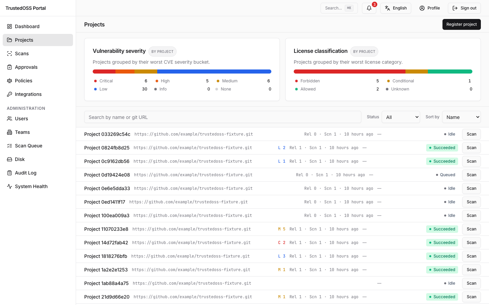
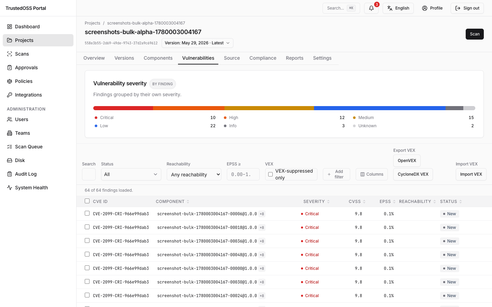
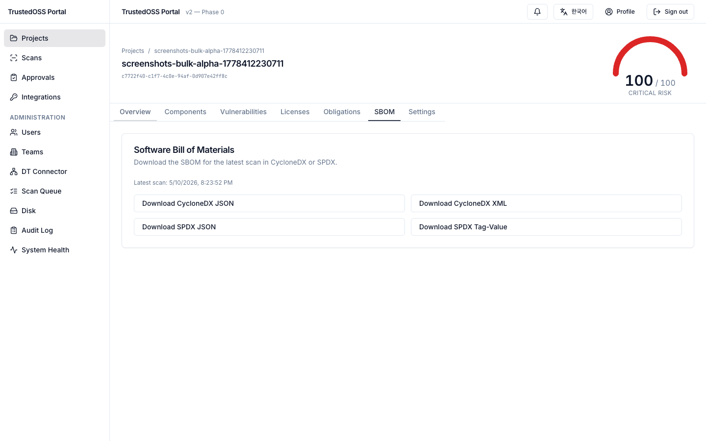
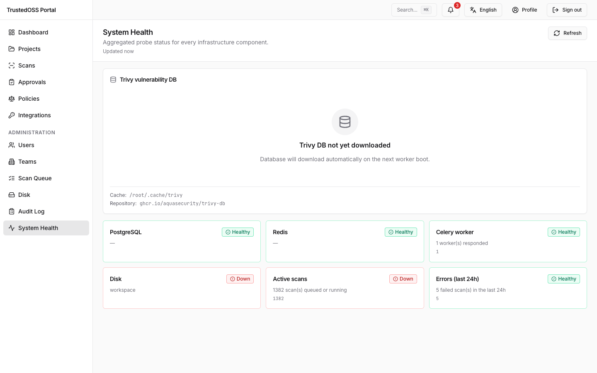

# TrustedOSS Portal

[](LICENSE)
[](CHANGELOG.md)
[](https://trustedoss.github.io/trustedoss-portal/)
[](https://www.bestpractices.dev/projects/13060)

> Open-source enterprise SCA portal — manage CVEs, license compliance, and SBOMs in one self-hosted UI.

**TrustedOSS Portal** is an Apache-2.0 licensed, self-hosted alternative to commercial Software Composition Analysis (SCA) products. It unifies vulnerability tracking (CVE), license compliance, and Software Bill of Materials (SBOM) management for engineering and legal teams.

> **🔭 Live demo:** *Coming soon.* A hosted read-only demo will be published shortly; until then you can run a local read-only demo with `DEMO_READ_ONLY=true`. See [Live demo](https://trustedoss.github.io/trustedoss-portal/docs/installation/live-demo).

---

## Why TrustedOSS Portal

- **Self-hosted, no vendor lock-in.** Apache-2.0, deployable via `docker-compose` or Helm. No per-seat licensing.
- **Unified risk view.** CVEs, licenses, and SBOM in one project page — no context switching.
- **CI/CD native.** REST API + GitHub/GitLab webhooks + build-blocking gate (Critical CVE / forbidden license → exit 1).
- **Enterprise-grade workflows.** Component approval, license obligations + auto-NOTICE generation, append-only audit log, RBAC.
- **Internationalized from day one.** English and Korean UI — and this documentation — shipped together.


*Project list — risk roll-up across every scanned project.*


*Vulnerability list — CVEs from Trivy's unified DB (NVD + OSV + GHSA + EPSS + KEV) with a 7-state VEX triage workflow.*


*SBOM tab — CycloneDX and SPDX export in JSON, XML, and Tag-Value.*


*Admin System Health — service status, scan queue, disk, and Trivy DB freshness at a glance.*

## Feature highlights

- Component detection across 30+ language ecosystems (cdxgen, CycloneDX generator), with direct vs. transitive dependency-graph depth
- License classification with allowed / conditional / forbidden tiers, scored against a fixed classification catalog (dynamic per-team policy editing is on the [roadmap](ROADMAP.md))
- Vulnerability detection via Trivy's unified DB (NVD + OSV + GitHub Advisory + EPSS + KEV) with weekly DB refresh, automatic re-detection of new CVEs, 7-state VEX triage, EPSS prioritization (column / sort / filter / policy-gate threshold), and per-finding `fixed_version`
- Container image scanning for OS-package CVEs (Trivy)
- SBOM export — CycloneDX (JSON/XML) + SPDX (JSON/Tag-Value), byte-stable; VEX export **and** VEX consumption (import OpenVEX / CycloneDX VEX to auto-suppress findings)
- Vulnerability report as PDF (`GET /v1/projects/{id}/vulnerability-report.pdf`); Excel and compliance-PDF reports are on the [roadmap](ROADMAP.md)
- Obligations tracking + auto-generated `NOTICE` files (text / markdown / HTML)
- Component approval workflow (Pending → Under Review → Approved / Rejected)
- Notifications: Email (SMTP), Slack, Microsoft Teams
- Admin: user/team management, Trivy DB monitoring + weekly refresh, scan queue, disk dashboard, audit log
- CI integrations: GitHub Action, GitLab CI template, Jenkinsfile example (Jenkins has no native plugin — the Jenkinsfile is a worked example)
- Hosted OpenAPI reference on the docs site, a `/health/ready` schema-gated readiness probe, a read-only live-demo mode, and a production-grade Helm chart

## Tech stack

| Layer | Technology |
|---|---|
| Backend | FastAPI · SQLAlchemy 2.0 · Alembic |
| Database | PostgreSQL 17 |
| Async | Celery + Redis |
| Frontend | React 18 · Vite · shadcn/ui · Tailwind CSS |
| Server state | TanStack Query |
| Client state | Zustand |
| Realtime | WebSocket (scan progress streaming) |
| Auth | FastAPI-Users (JWT + OAuth2) |
| i18n | react-i18next |
| Tests | pytest · Playwright (harness pattern) |
| Docs | Docusaurus |
| CI/CD | GitHub Actions |
| Containers | Docker Compose (dev/prod split), Helm chart |

## Quick start (development)

```bash
git clone https://github.com/trustedoss/trustedoss-portal.git
cd trustedoss-portal
cp .env.example .env

docker-compose -f docker-compose.dev.yml up
# → http://localhost:5173 (frontend) · http://localhost:8000/docs (API)
```

After roughly 30 seconds the dev containers (`postgres`, `redis`, `backend`, `celery-worker`, `frontend`) are healthy.

### Other ways to run it

- **Production (Docker Compose)** — use the bundled `docker-compose.yml` (Traefik + Let's Encrypt). See the [installation guide](https://trustedoss.github.io/trustedoss-portal/docs/installation/docker-compose).
- **Production (Kubernetes / Helm)** — the production-grade chart (`charts/trustedoss`) ships bundled-or-external PostgreSQL & Redis, an Ingress with cert-manager TLS, and a migration Job. See the [Helm / Kubernetes guide](https://trustedoss.github.io/trustedoss-portal/docs/installation/helm).
- **Read-only live demo** — run any deploy with `DEMO_READ_ONLY=true`. See [Live demo](https://trustedoss.github.io/trustedoss-portal/docs/installation/live-demo).
- **API reference** — the hosted OpenAPI reference is at [`/reference/api`](https://trustedoss.github.io/trustedoss-portal/reference/api).

## Repository layout

```
trustedoss-portal/
├── apps/
│   ├── backend/         FastAPI app (api, core, models, services, tasks, integrations)
│   └── frontend/        React + Vite + shadcn/ui app
├── charts/trustedoss/   Helm chart
├── docs-site/           Docusaurus documentation site (EN/KO)
├── actions/scan/        GitHub Actions composite action — trigger + gate a CI build
├── scripts/             install / upgrade / backup / restore
└── .github/             workflows, issue templates, PR template, CODEOWNERS
```

## Documentation

- **[Documentation site](https://trustedoss.github.io/trustedoss-portal/)** — install, scan, operate, and integrate (English + Korean)
- [`ROADMAP.md`](ROADMAP.md) — public roadmap
- [`CHANGELOG.md`](CHANGELOG.md) — release history

### For contributors

- [`CONTRIBUTING.md`](CONTRIBUTING.md) — local setup, conventions, and the PR process
- [`GOVERNANCE.md`](GOVERNANCE.md) — decision-making model and maintainer responsibilities
- [`MAINTAINERS.md`](MAINTAINERS.md) — current maintainers and areas of ownership
- [`SUPPORT.md`](SUPPORT.md) — where to ask questions and report problems

## Contributing

Contributions are welcome — code, documentation, translations, bug reports, and design feedback. Start with [`CONTRIBUTING.md`](CONTRIBUTING.md) for local setup and the PR process, and [`SUPPORT.md`](SUPPORT.md) if you have a question first. All participants are expected to follow the [Code of Conduct](CODE_OF_CONDUCT.md).

## SCA self-scan

[](https://github.com/trustedoss/trustedoss-portal/actions/workflows/sca-self.yml)

The portal dog-foods its own toolchain. A nightly GitHub Actions workflow ([`.github/workflows/sca-self.yml`](.github/workflows/sca-self.yml)) generates a CycloneDX SBOM with cdxgen, runs Trivy against it, and auto-opens / closes a labelled GitHub issue when Critical CVEs appear in our dependency tree.

## Security

Please do not open a public issue for an unpatched vulnerability. See [`SECURITY.md`](SECURITY.md) for the private disclosure process.

## License

Apache License 2.0 — see [`LICENSE`](LICENSE) and [`NOTICE`](NOTICE).
