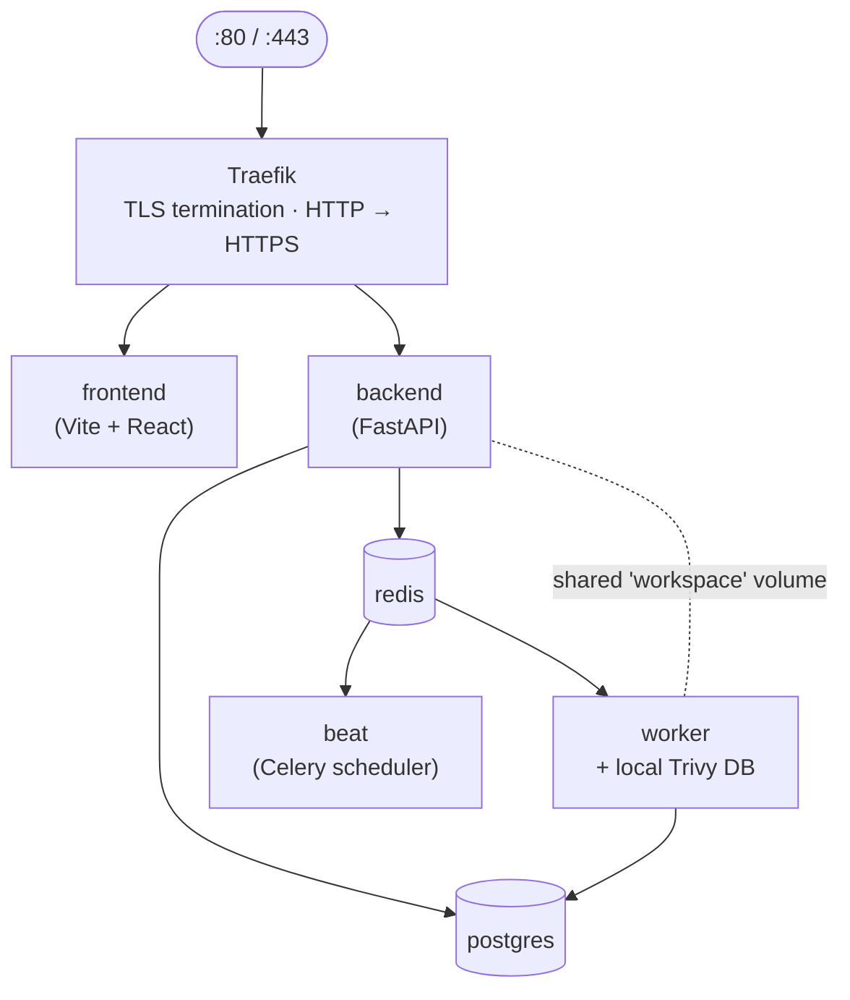

# Architecture

This page explains how TrustedOSS Portal is wired up under the hood. It is the place to start if you want to extend the portal, integrate it into an existing platform, or evaluate it against an internal architecture review.

:::note Audience
Architects, platform engineers, and security reviewers. Familiarity with FastAPI, PostgreSQL, Celery, and Docker.
:::

## Services

The production stack runs seven container services:

| Service | Image | Role |
|---|---|---|
| `traefik` | `traefik:v3.2.1` | Edge proxy. TLS termination via Let's Encrypt HTTP-01. HTTP→HTTPS redirect. |
| `postgres` | `postgres:17.2-alpine` | Primary store. All persistent state. |
| `redis` | `redis:7.4-alpine` | Celery broker + result backend. WebSocket pub/sub. |
| `backend` | `trustedoss/backend:<tag>` | FastAPI + uvicorn (4 workers). Reachable via Traefik on `/api`, `/health`. |
| `worker` | `trustedoss/backend-worker:<tag>` | Celery worker with `cdxgen`, scancode, Trivy, JRE bundled (JRE is for `cdxgen`'s Maven / Gradle SBOM enumeration). The worker also holds the local **Trivy DB** at `/var/lib/trivy`. |
| `beat` | `trustedoss/backend-worker:<tag>` | Celery Beat scheduler. Trivy DB refresh (weekly), vulnerability re-match (after each refresh), backup (daily). |
| `frontend` | `trustedoss/frontend:<tag>` | nginx serving the Vite build. Reachable via Traefik on `/`. |

Image tags are pinned (`CLAUDE.md` rule #9 — never `:latest`).

:::note Dependency-Track was removed in v0.10.0
Earlier releases shipped Dependency-Track as an optional eighth service. v0.10.0 removed it in favour of Trivy as the single vulnerability engine — see [ADR-0001](https://github.com/trustedoss/trustedoss-portal/blob/main/docs/decisions/0001-replace-dt-with-trivy.md) and the [v0.10.0 release notes](../release-notes/v0.10.0.md). The Trivy DB lives inside the worker container; there is no separate vulnerability-engine service.
:::

:::note
The `/metrics` route is reserved at the Traefik level (`docker-compose.yml`) but no backend handler is mounted in this release; the Prometheus exporter is on the post-GA roadmap.
:::

## Network



Only `traefik` exposes ports to the host (`80`, `443`). Every other service is reachable inside the compose network only.

## Data layout

PostgreSQL is the single source of truth. Significant tables:

| Table | Purpose |
|---|---|
| `users`, `teams`, `team_memberships` | Identity + RBAC. |
| `api_keys` | Service-account credentials (bcrypt-hashed). |
| `projects` | One row per project. Owns scans, components, findings. |
| `scans` | Scan lifecycle records (queued → terminal). |
| `components`, `component_licenses` | Per-scan SBOM rows + license attribution. |
| `vulnerability_findings` | CVEs with VEX state, justification, and Trivy-supplied fixed-version metadata. |
| `obligations`, `obligation_kinds` | License obligations per component. |
| `approvals` | Conditional-license approval workflow. |
| `audit_log` | Append-only write history. CHECK-constrained immutable. |
| `webhook_deliveries` | `(source, delivery_id)` for idempotency. |
| `notifications` | Outbound notification log + dedup keys. |
| `backups` | Backup manifest history (read-only by application). |

Migrations are forward-only Alembic. Schema and data migrations live in separate revisions.

## Scan pipeline

A scan is a Celery task chain. Source scan stages (see `apps/backend/tasks/scan_source.py`):

```
1. bootstrap     (workspace setup, locks the per-project lock)
2. fetch         (git clone / fetch / checkout)
3. prep          (workspace layout)
4. cdxgen        (cdxgen → CycloneDX SBOM + declared licenses)
5. scancode      (scancode scans first-party source → detected licenses; best-effort)
6. sbom_upload   (CycloneDX SBOM persisted to the workspace, ready for matching)
7. vuln_match    (`trivy sbom` matches the CycloneDX SBOM against the local Trivy DB)
8. finalize      (write to PostgreSQL in one transaction per scan)
```

The stage slugs above are emitted as `scan.<id>.progress` WebSocket frames so the UI can render a live progress bar — see [User guide — Scans](../user-guide/scans.md#pipeline-stages-source).

Container scan stages (see `apps/backend/tasks/scan_container.py`):

```
1. bootstrap
2. trivy         (OS-package CVE detection)
3. persist       (write findings to PostgreSQL)
4. finalize
```

Stage transitions emit WebSocket events (`scan.<id>.progress`) so the UI updates in real time. Completion fires the appropriate notification triggers.

## License-tier classification {#ort-rules}

:::warning Classification source in this release
In this release, license-tier classification is **not** ORT-rule-driven. The
tier (`forbidden` / `conditional` / `permissive` / `unknown`) comes
from the hard-coded `_LICENSE_CATEGORY_DEFAULTS` dictionary in
`apps/backend/tasks/scan_source.py`. The repo's `ort/rules.kts` is a
placeholder reserved for a future customization path. Editing
`ort/rules.kts` has no effect in this release.
:::

The classifier maps SPDX IDs to tiers as follows (representative
subset — see `_LICENSE_CATEGORY_DEFAULTS` for the canonical list):

```python
_LICENSE_CATEGORY_DEFAULTS: dict[str, str] = {
    # forbidden
    "AGPL-3.0-only": "forbidden",
    "AGPL-3.0-or-later": "forbidden",
    "GPL-2.0-only":  "forbidden",
    "GPL-2.0-or-later": "forbidden",
    "GPL-3.0-only":  "forbidden",
    "GPL-3.0-or-later": "forbidden",
    "SSPL-1.0": "forbidden",
    "BUSL-1.1": "forbidden",
    # conditional
    "LGPL-2.1-only": "conditional",
    "LGPL-2.1-or-later": "conditional",
    "LGPL-3.0-only": "conditional",
    "LGPL-3.0-or-later": "conditional",
    "MPL-2.0": "conditional",
    "EPL-1.0": "conditional",
    "EPL-2.0": "conditional",
    "CDDL-1.0": "conditional",
    # ... permissive entries omitted
}
# Lookup is exact-match; missing keys (including suffix-less variants
# like "LGPL-3.0") fall through to "unknown" and need human review.
```

Operator override path in this release:

1. Patch `_LICENSE_CATEGORY_DEFAULTS` in `apps/backend/tasks/scan_source.py`.
2. Rebuild and restart the worker (`docker-compose restart worker beat`).
3. Re-scan affected projects to apply the new classification.

Per-organization rule customization is planned; the legacy
`ORT_RULES_PATH` env var and the `ort/rules.kts` mount in the worker
image are vestigial placeholders from the removed ORT stage and have no
effect in this release.

The portal does not auto-re-classify historical scans — the historical record is preserved with the classification that was in effect at scan time.

## Vulnerability matching (Trivy) {#trivy}

CVE matching uses Trivy directly — no external engine. The worker image ships with the `trivy` binary; the Trivy DB (a compiled bundle of NVD + OSV + GHSA + EPSS + KEV) lives at `/var/lib/trivy/db/` on a persistent volume.

- **Boot-time DB download** — `trivy --download-db-only` runs once before Celery picks up tasks.
- **Weekly DB refresh** — a Celery Beat task pulls the latest bundle. The cadence is `TRIVY_DB_REFRESH_HOURS` (default `168`).
- **Automatic re-match** — after each successful refresh, a beat task walks every project's most-recent SBOM and writes new `vulnerability_findings` rows.
- **Air-gapped operation** — `TRIVY_DB_REPOSITORY` swaps the upstream OCI registry for an internal mirror; per-scan matching is fully offline.

See [Vulnerability data (Trivy DB)](../admin-guide/vulnerability-data.md) for the operator lifecycle and [Data sources](./data-sources.md) for the per-source matrix.

## Authentication & sessions

- **Password** — bcrypt cost 12, NIST 800-63B banned-password list, ≥ 12 chars, no PII reuse.
- **Access token** — JWT, 30-minute lifetime, `HS256` signed (symmetric, `SECRET_KEY`), in-app memory only.
- **Refresh token** — 7-day lifetime, **rotation with reuse detection**. HttpOnly + Secure + SameSite=Lax cookie.
- **API keys** — `tos_<prefix>_<secret>` accepted via `Authorization: Bearer …`. bcrypt-hashed; full key shown once at creation.
- **CSRF posture** — the SPA uses bearer tokens (CSRF-immune by construction). The refresh cookie is HttpOnly + Secure + SameSite=Lax, which blocks the cross-site POST attack class without an explicit CSRF token. No separate CSRF token endpoint exists in this release.
- **Rate limit** — IP-keyed 5/minute on login and forgot-password, 429 with `Retry-After`. Per-address cooldown on password-reset emails.

## Authorization (RBAC)

`super_admin` (org), `team_admin` (per team), `developer` (per team). See [Users & teams → roles](../admin-guide/users-and-teams.md#roles).

A request's effective role is derived from `(user, target_team)`. Cross-team API calls are 403.

Admin endpoints additionally use the **404-existence-hide** pattern: a `developer` requesting an admin URL receives 404, not 403, so the URL surface is not enumerable.

## Errors — RFC 7807

Every 4xx / 5xx response uses `application/problem+json`:

```json
{
  "type":     "https://trustedoss.io/problems/last-super-admin",
  "title":    "Cannot demote the last super_admin",
  "status":   409,
  "detail":   "At least one super_admin must remain in the organization.",
  "instance": "/v1/admin/users/01H…/role"
}
```

Domain-specific extensions are `snake_case` and modelled in OpenAPI.

## Logging

`structlog` JSON lines, one event per line. The middleware seeds `request_id` (from `X-Request-ID` or a UUIDv7), `user_id`, `team_id`, and (in Celery) `task_id`. PII is masked through the `mask_pii` helper before log emission — passwords, tokens, API keys, and full email addresses never appear in logs.

## Observability

Out of the box:

- **Logs** — `docker-compose logs <service>` (structured JSON, `structlog`).
- **Health** — `/health` (backend), `/healthz` (frontend container), `/admin/health` UI for the operator dashboard.
- **Metrics** — basic service-health metrics are shipped at the Traefik level via its access log. A backend `/metrics` endpoint with a Prometheus exporter is on the post-GA roadmap.

OpenTelemetry tracing exporter and a bundled Jaeger overlay are on the post-GA roadmap (Phase B) — there is no `docker-compose.tracing.yml` in this release.

## Deployment topologies

The reference deployment is a **single-host docker-compose** install. Variations:

- **Single-host (default)** — the seven services above; the Trivy DB downloads on worker boot.
- **Air-gapped** — point `TRIVY_DB_REPOSITORY` at an internal OCI mirror so the worker never reaches the public registry. See [Vulnerability data — Air-gapped operation](../admin-guide/vulnerability-data.md#air-gapped).

A **Helm chart** ships from v0.10.0. v0.10.0 chart 0.3.0 adds:

- Per-component HPA (worker scales by queue depth).
- StatefulSet for PostgreSQL with PVC.
- ServiceMonitor for the Prometheus operator.
- Ingress + cert-manager for TLS.

Multi-host docker-compose (e.g. workers on separate machines) is technically possible but not the supported path; use the Helm chart for that scale.

## Backup model

`pg_dump --clean --if-exists | gzip` for the database, `tar.gz` for the workspace, plus a manifest with the Alembic head. See [Backup & restore](../admin-guide/backup-and-restore.md) for the full procedure.

## Security posture summary

- Apache-2.0 licensed; SBOM published at GA.
- OWASP Top 10 reviewed in Phase 8 (`security-reviewer` agent + manual audit).
- Dependencies pinned via `pip-tools` (backend) and `package-lock.json` (frontend); `pip-audit` and `npm audit` run in CI.
- Trivy scan on every image build.
- TLS-only in production (Traefik enforces HTTPS).
- Secrets never logged; `mask_pii` enforced via test fixtures.

## See also

- [Environment variables](./env-variables.md)
- [API overview](./api-overview.md)
- [Vulnerability data (Trivy DB)](../admin-guide/vulnerability-data.md)
- [Data sources](./data-sources.md)
- [Glossary](./glossary.md)
