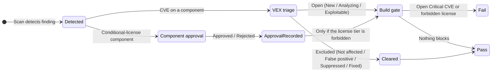

# Triage

**Triage** is where a raw scan result becomes a decision. TRUSCA has three triage surfaces, each documented in full on its own page: **VEX vulnerability triage** for CVEs, **component approval** for conditional-license components, and the **build gate** that turns those decisions into a pass/fail for CI. This page is the map that ties them together — one place to see how a single finding travels across all three, and, just as important, **which decisions actually reach the build gate and which do not**.

VEX (Vulnerability Exploitability eXchange) is the standard vocabulary for recording whether a CVE (Common Vulnerabilities and Exposures) genuinely affects your product. A CVE is the public identifier for a known vulnerability.

:::note Audience
Engineers and team leads who triage findings and need to understand how their decisions affect CI. Recording a VEX verdict requires `developer` or higher; disposing a component approval and moving a finding into `Suppressed` require `team_admin`.
:::

## The three triage surfaces {#surfaces}

Each surface owns a different kind of decision. Read the linked page for the full state machine, permissions, and API; this page only shows how they connect.

| Surface | Applies to | Decision recorded | Reaches the build gate? |
|---|---|---|---|
| [VEX vulnerability triage](./vulnerabilities.md#vex-state-machine) | A CVE finding on a component | The finding's exploitability verdict (New → Analyzing → a terminal VEX state) | **Yes** — excluded states drop out of the Critical-CVE count |
| [Component approval](./approvals.md#state-machine) | A component carrying a conditional license (LGPL, MPL, EPL, CDDL) | Whether the component's license use is approved (Pending → Under Review → Approved / Rejected) | **No** — the gate never reads the approval verdict (see [the caveat](#approval-does-not-gate)) |
| [Build gate](./vulnerabilities.md#severity-model) | The project's latest successful scan | Pass / Fail for CI | It **is** the outcome — it reads VEX verdicts and the `forbidden` license tier |

## How a finding flows {#flow}

A finding enters triage the moment a scan detects it. Its path depends on what kind of finding it is — a vulnerability or a conditional-license component — and the two paths converge only at the build gate.

The two tracks are independent by design:

- A **CVE finding** is triaged with a [VEX verdict](./vulnerabilities.md#vex-state-machine). Every finding starts in `New`, moves through `Analyzing`, and lands on a terminal state. The four *excluded* states (`Not affected`, `False positive`, `Suppressed`, `Fixed`) drop the finding out of the build-gate count; the *open* states (`New`, `Analyzing`, `Exploitable`) keep it counting. When many findings share a disposition, [bulk-transition](./vulnerabilities.md#bulk-transition) them in one action rather than one drawer at a time.
- A **conditional-license component** raises a [component approval](./approvals.md#state-machine) request in parallel. A reviewer approves or rejects it, and the verdict is recorded for audit — but the gate does not consult it (see below).

## Where each decision reaches the build gate {#gate-reach}

This is the point the three surfaces are most often confused on. The [build gate](./vulnerabilities.md#severity-model) fails a build on exactly two conditions:

1. at least one **open Critical CVE** (a finding still in an open VEX state at the configured severity threshold), or
2. at least one component whose license resolves to the **`forbidden`** tier.

VEX triage feeds condition 1 directly: moving a finding to an excluded state removes it from the count on the next scan. Component approval feeds **neither** condition.

### Component approval does not gate the build {#approval-does-not-gate}

:::warning
A **Rejected** component approval does **not** block the build. The gate evaluates the `forbidden` license tier only (`apps/backend/services/policy_gate.py`); it never reads the approval verdict. A rejected component still classifies as `conditional` on the next scan, and the build proceeds. See the [Rejected verdict caveat](./approvals.md#rejected-verdict) for the full explanation and the manual follow-up (remove the dependency, or escalate the license to `forbidden`).
:::

To make a license actually block CI, change its tier rather than its approval verdict — a team can promote a license to `forbidden` at runtime through a [license policy](../reference/license-policies.md#dynamic-gate-evaluation), no redeploy required. To make a non-Critical CVE block CI, add the [EPSS build-gate dimension](../ci-integration/github-actions.md#gate-the-build-on-epss-optional).

:::note One gate, latest scan only
The gate always reflects the project's **latest successful scan**. A triage decision you record now shows in the UI immediately but only changes the gate verdict on the next scan. If a scan was already running when you triaged, that scan still carries the prior state — trigger a new scan to re-evaluate.
:::

## Verify it worked

Walk one finding of each kind through its surface and confirm the gate reads the VEX track but not the approval track.

<!-- docs-uat: id=triage-vex-to-gate kind=manual tier=manual -->
1. On the **Vulnerabilities** tab, move an open Critical CVE to `Not affected`. The status badge updates immediately (the same transition the VEX harness covers below). On the next scan, the [build-gate](./vulnerabilities.md#severity-model) Critical-CVE count drops by one.
<!-- docs-uat: id=triage-vex-badge kind=ui harness=vulnStatusUpdates(portal-web) tier=nightly -->
2. The VEX status badge reflects the new state without a page reload.
<!-- docs-uat: id=triage-approval-not-gated kind=manual tier=manual -->
3. Reject a conditional-license component's approval, then re-scan. The build gate verdict is **unchanged** — confirming approval does not gate — while the [Approvals](./approvals.md) queue and audit log both record the Rejected verdict.

## Troubleshooting

### A rejected component did not block CI

By design — component approval never reaches the gate. See [Component approval does not gate the build](#approval-does-not-gate). Block it by promoting the license to `forbidden` via a [license policy](../reference/license-policies.md#dynamic-gate-evaluation), or remove the dependency.

### A suppressed CVE still counts in the gate

The gate reflects the **latest successful scan**. A VEX verdict recorded after that scan applies only on the next one. Trigger a new scan, then re-check the gate. Confirm too that the finding reached an *excluded* VEX state (`Not affected`, `False positive`, `Suppressed`, `Fixed`) — the *open* states still count. See the [VEX state machine](./vulnerabilities.md#vex-state-machine).

### A non-Critical CVE I care about never fails the build

By default the gate fails only on Critical CVEs and forbidden licenses. Add the EPSS dimension so a high-probability CVE fails regardless of severity — see [Gate the build on EPSS](../ci-integration/github-actions.md#gate-the-build-on-epss-optional).

## See also

- [Vulnerabilities](./vulnerabilities.md) — the full VEX state machine, severity model, and bulk-transition
- [Approvals](./approvals.md) — the component approval workflow and the Rejected-verdict caveat
- [GitHub Actions](../ci-integration/github-actions.md) — wiring the build gate into CI
- [License policies](../reference/license-policies.md) — change a license tier so it actually gates
