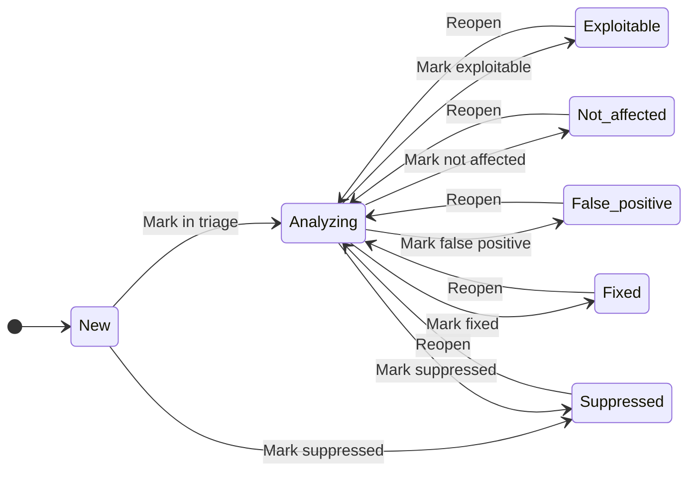

# Vulnerabilities

The **Vulnerabilities** tab lists every open CVE (Common Vulnerabilities and Exposures) the scan pipeline correlated against the project's components. Findings persist across scans — once a CVE is found, it stays in the project's history with its status and triage notes until the underlying component is removed or upgraded.


:::note Audience
Engineers triaging individual findings; security leads tracking SLA. Mutating the VEX status requires `developer` or higher; bulk suppression requires `team_admin`.
:::

## "Vulnerability data unavailable" banner {#vuln-data-unavailable-banner}

A blue **Vulnerability data unavailable** banner appears at the top of the Vulnerabilities tab when the portal can show you the *components* a scan discovered but no findings — typically because the local Trivy DB has not finished downloading yet (a fresh deployment whose worker just booted), or the DB download failed. The banner explains the cause and lists the next steps:

- An admin should check the worker's Trivy DB on disk — see [Vulnerability data — Verify it worked](../admin-guide/vulnerability-data.md#verify-it-worked) for the exact command. The forthcoming **Vulnerability data** card under `/admin/health` (roadmap) will surface freshness in the UI.
- Once the Trivy DB lands, the automatic re-match beat picks up findings on every project's most-recent SBOM — no in-app action is required from you. The banner clears automatically on the next page load that returns at least one finding.

The banner is *informational*, not an error — `0 findings` on a project that is actually clean looks identical at the API level, so the message intentionally points you at the diagnostic surfaces instead of asserting a verdict.

## Severity model

| Severity | Color token | CVSS v3 (typical) | Build gate |
|---|---|---|---|
| **Critical** | `#dc2626` | 9.0–10.0 | Exits 1 (default) |
| **High** | `#ea580c` | 7.0–8.9 | Configurable per project |
| **Medium** | `#ca8a04` | 4.0–6.9 | No effect |
| **Low** | `#2563eb` | 0.1–3.9 | No effect |
| **Info** | `#71717a` | — | No effect |

The default policy fails the build only on `Critical`. Project owners can lower the threshold to `High` per project.

## VEX state machine

Findings follow the [CycloneDX VEX (Vulnerability Exploitability eXchange)](https://cyclonedx.org/capabilities/vex/) seven-state model. Each finding starts in **New** and transitions as analysts triage it.



| State | Definition | Build gate |
|---|---|---|
| **New** | Just discovered; not triaged. | Counts. |
| **Analyzing** | Triage in progress. | Counts. |
| **Exploitable** | Confirmed exploitable in this project's context. | Counts. |
| **Not affected** | Component is present but the vulnerable code path is unreachable. | Excluded. |
| **False positive** | Detection is wrong (e.g., wrong purl). | Excluded. |
| **Suppressed** | Operator-silenced (`not_affected` with explicit suppression). | Excluded. |
| **Fixed** | Resolved (component upgraded or patch applied). | Excluded. |

Transitions are logged in the audit log with actor, previous status, new status, and the required justification message.

### Required justification

Every transition out of `New` / `Analyzing` requires a free-text justification (≥ 10 chars). The portal stores the justification verbatim — keep it factual ("upgraded lodash to 4.17.21", "vulnerable code path is in `dev_only` module"). The text appears in CycloneDX VEX exports.

### When a status needs a second person {#transition-approvals}

By default any analyst with the right role closes a finding on their own. An
organization can decide that some outcomes are not one person's to reach:
closing a finding as **Suppressed** or **Not affected** ends the obligation
without the vulnerability being fixed, and some teams want that agreed by
somebody else before it takes effect.

An administrator turns this on per status in **Policies → Build gate →
"Statuses that need a second person"**. Nothing is selected by default, and
with nothing selected every transition stays a single action.

Unlike the thresholds on the same screen, this setting is a union rather than
an override: a team's list is added to whatever its organization requires. A
team can ask for a second person on more statuses than the organization did,
never on fewer. That is deliberate. The role that can reach a gated status is
the same role that edits the team policy, so a team-level override would put
the control in the hands of the people it applies to.

Once a status is listed:

1. The ordinary transition is refused with `409` and the reason. The finding
   does not move. The same applies to the bulk transition and to VEX import, so
   neither a batch nor an uploaded document is a way around it. An import
   reports those statements as skipped with reason `approval_required` and
   applies the rest of the document normally.
2. Write the justification and choose **Send for agreement**. This records a
   request and leaves the finding where it is.
3. The request appears on the **Approvals** page for everyone in the team who
   administers it. The person who asked sees their own request listed as
   waiting, without buttons.
4. Another team administrator agrees or refuses. On agreement the finding moves
   and the change is audited exactly like a direct transition; on a refusal the
   finding stays where it was and the refusal is kept as part of the record.

Two constraints are worth knowing before turning this on:

- **The requester cannot be the approver.** This is enforced on the person, not
  the role, so a team with a single administrator cannot complete any request.
  Give the team a second administrator first.
- **One open request per finding.** A second request while one is waiting is
  refused, so an approver is never deciding one of two conflicting proposals.

If the finding moves while a request is waiting (someone reopens it, say),
agreeing to the stale request fails with `422` and the request stays open
rather than recording an agreement to something that never happened.

## The findings table

Columns:

- **CVE** — the CVE-YYYY-NNNN identifier (plain text; click-through to NVD is on the roadmap).
- **Severity** — color-coded badge.
- **CVSS** — numeric CVSS v3 score from the upstream feed.
- **EPSS** — the EPSS probability rendered as a percentage (for example `97.3%`). CVEs without an EPSS value show `—`. See [EPSS — exploitation probability](#epss--exploitation-probability).
- **KEV** — a badge shown when the CVE is listed in the CISA KEV (Known Exploited Vulnerabilities) catalog, together with the catalog's remediation due date. See [KEV — known exploited vulnerabilities](#kev).
- **Title** — short summary from the advisory.
- **Affected** — the affected component (`name@version`).
- **Status** — current VEX status.
- **SLA due** — the remediation-SLA due date, graded **Overdue** / **Due soon** / **On track**; `—` when the severity carries no SLA. See [Remediation SLA and aging](#sla).
- **Discovered** — when *this* scan recorded the finding. A re-scan resets it; the SLA clock uses **First detected** instead — see [First detected vs. Discovered](#first-detected-vs-discovered).

Filters on the inline bar: severity, status, an **EPSS threshold** filter (`min_epss`), an **SLA** state filter (`sla`), plus a **search** box (free text against CVE ID / title / component) and sort + order controls. The default sort is **Priority** — KEV-listed findings first, then severity, then EPSS; see [Priority sort](#priority-sort). The sort control also includes **EPSS** (`sort=epss`) and **SLA due** (`sort=sla_due`); rows without a value for the chosen key sort last.

The toolbar also carries a **Group by** control that swaps the flat findings table for the upgrade-centric remediation worklist — see [Group by upgrade](#group-by-upgrade).

## The drawer — finding detail

Click any row to open:

- **Summary** — title, description, CWE, CVSS vector, and the **EPSS score and percentile** when the Trivy DB supplies them (otherwise `—`). See [EPSS — exploitation probability](#epss--exploitation-probability). A finding whose CVE is in the CISA KEV catalog also shows the **KEV badge** and the remediation due date here — see [KEV — known exploited vulnerabilities](#kev). The summary also carries the **SLA chip** (due date plus the Overdue / Due soon / On track state) and a **First detected** row — the start of the SLA clock; see [Remediation SLA and aging](#sla).
- **References** — vendor advisories, fix commits, exploit databases.
- **Affected** — the upstream-reported affected range with the project's component version highlighted, plus the **fixed version** — the version that remediates this CVE *for this component* — when the scan pipeline could determine one. See [Fixed version — the version that remediates the CVE](#fixed-version--the-version-that-remediates-the-cve). The affected component also carries its **dependency depth**: whether it is a **direct** dependency you declared (depth `1`) or a **transitive** one pulled in by another package (depth `2+`). A CVE in a direct dependency is usually yours to fix by bumping the declared version; a CVE in a transitive dependency is fixed by upgrading the direct parent that requires it — see [Direct vs. transitive (dependency depth)](./components-and-licenses.md#dependency-depth).
- **Analysis** — VEX status action buttons. **The buttons you see depend on the finding's _current_ state.** Every terminal decision is routed through the `analyzing` state, so a brand-new finding cannot jump straight to a verdict:
  - **`new`** (just discovered) → **Mark in triage** (`analyzing`) or **Mark suppressed** (`suppressed`). You **cannot** go directly to "not affected" / "exploitable" / "false positive" / "fixed" — triage first.
  - **`analyzing`** (working state) → the five verdicts: **Mark exploitable**, **Mark not affected**, **Mark false positive**, **Mark fixed**, **Mark suppressed**.
  - any **terminal** state (`exploitable` / `not_affected` / `false_positive` / `fixed` / `suppressed`) → **Reopen** back to `analyzing` to re-triage.

  Click a button to open the justification dialog and submit. Moving **into** `suppressed` requires `team_admin` or higher (suppression is gated to keep the audit trail clean); every other transition is `developer` or higher.
- **History** — VEX status-transition timeline (who changed the status, when, with what justification).


## Bulk-transition findings {#bulk-transition}

When several findings share the same disposition — for example, ten findings all on the same library that you've just upgraded — the toolbar's **Bulk action bar** lets you transition them in one shot instead of opening each drawer.


1. Tick the row-level checkboxes (or the header tri-state checkbox to select every row on the current page — selection clears automatically when you change filter or page so a stale selection cannot leak across views).
2. The action bar at the top of the table shows the selected count and the available verdicts for the *common* current state of the selected rows. If the selection mixes states whose legal next-state intersection is empty, the verdict buttons are disabled with a tooltip explaining why.
3. Pick a verdict, enter the justification once (the same text is applied to every row), and submit.

The response is **per-row**: every selected finding gets an outcome in the result alert. Each row carries `success`, an HTTP-style `status_code`, and a machine-readable `error` code. The codes are:

- **transitioned** — `success: true`, `status_code: 200`, `error: null`. The status actually flipped.
- **already_at_target** — `success: true`, `status_code: 200`, `error: "already_at_target"`. The row was already in the requested status; an idempotent no-op is a success, not a failure (it just writes no audit row).
- **invalid_transition** — `success: false`, `status_code: 422`. The move is not allowed by the workflow matrix; the row carries `allowed_to` listing the legal next states.
- **forbidden** — `success: false`, `status_code: 403`. The actor's role is insufficient (e.g. a `developer` moving a row to `Suppressed`).
- **not_found** — `success: false`, `status_code: 404`. The id is not a finding in this project.

The envelope's `succeeded` / `failed` counts sum these (`already_at_target` counts as succeeded). The page reloads the table once the alert closes so the new states are reflected.

Server-side the request is a single `POST /v1/projects/{id}/vulnerabilities:bulk-transition` call with the selected finding ids, a target status, and the justification. The endpoint runs the same state-machine guard as the per-row endpoint and emits one audit-log row per actually-transitioned finding. The cap is **200 ids per call** — for selections larger than that, page through and submit in chunks.

:::caution Suppressed transitions still require `team_admin`
The bulk endpoint does **not** widen the permissions of the per-row endpoint. Moving *any* selected finding into `Suppressed` still requires `team_admin` (or higher) on the project's team — a `developer` submitting a bulk request that includes a `→ Suppressed` transition will see those rows reported as `forbidden` (`status_code: 403`) while the other rows in the same submission complete normally.
:::

## EPSS — exploitation probability

The portal surfaces the [EPSS (Exploit Prediction Scoring System)](https://www.first.org/epss/) score next to CVSS so you can tell *severe* CVEs apart from *likely-to-be-attacked* CVEs.

### EPSS vs. CVSS — what each one answers

- **CVSS** measures **severity** — the theoretical impact if a CVE is exploited. It does not say whether anyone is, or will, exploit it.
- **EPSS** measures the **probability of real-world exploitation** in the next 30 days, as a number from `0` to `1`.

The two are complementary. It is common to find a CVE with CVSS `9.8` (Critical) and an EPSS of `0.01` — severe on paper, but with a low predicted chance of being attacked. Sorting and filtering by EPSS lets you concentrate on the small set of findings that are *actually* dangerous and cut the noise.

:::caution EPSS is best-effort
EPSS data is sourced from the Trivy DB and is present **only for CVEs Trivy supplies an EPSS value for**. Findings without an EPSS value show `—` in the UI and `null` in the API — treat a missing EPSS as "unknown", not "low". EPSS never replaces CVSS or your VEX triage; it is one more signal.
:::

### How the portal displays EPSS

- **Score** — rendered as a percentage. An EPSS of `0.973` shows as `97.3%`.
- **Percentile** — rendered as "top N%". A finding in the 99th percentile shows as roughly "top 1%", meaning its score is higher than ~99% of all scored CVEs.
- **Missing** — `—` (the Trivy DB has no EPSS value for this CVE).

The score and percentile appear in the findings table's **EPSS** column and in the drawer's **Summary** section.

### Sort and filter by EPSS

- **Sort** — pick **EPSS** in the toolbar's sort control (descending puts the most-likely-exploited findings on top). Findings without an EPSS value always sort last (`NULLS LAST`), regardless of order.
- **Filter** — set the **EPSS threshold** (`min_epss`, a value from `0` to `1`) to show only findings with `epss_score >= min_epss`. For example, `min_epss=0.5` hides everything the model predicts has under a 50% chance of exploitation. Findings with no EPSS value are excluded by the threshold filter (a missing score cannot satisfy `>=`).

### Read EPSS from the API

`GET /v1/projects/{id}/vulnerabilities` returns `epss_score` and `epss_percentile` on every finding (both `null` when the Trivy DB supplied no value). The same fields appear on the finding detail (`GET /v1/vulnerability_findings/{finding_id}`) and on the nested `VulnerabilityRef`.

<!-- docs-uat: id=vulns-list-epss-api kind=api auth=admin url=/v1/projects/${PROJECT_ID}/vulnerabilities?sort=epss&order=desc expect=status:200 tier=nightly -->
Sort by EPSS, highest first:

<!-- docs-uat: id=vulns-api-list-epss kind=shell ctx=host tier=manual waiver=example-curl-placeholder-host-and-api-key -->
```bash
curl -sS \
  -H "Authorization: Bearer ${TRUSTEDOSS_API_KEY}" \
  "https://trustedoss.example.com/v1/projects/${PROJECT_ID}/vulnerabilities?sort=epss&order=desc"
```

Return only findings the model predicts have at least a 50% exploitation probability:

<!-- docs-uat: id=vulns-api-list-min-epss kind=shell ctx=host tier=manual waiver=example-curl-placeholder-host-and-api-key -->
```bash
curl -sS \
  -H "Authorization: Bearer ${TRUSTEDOSS_API_KEY}" \
  "https://trustedoss.example.com/v1/projects/${PROJECT_ID}/vulnerabilities?min_epss=0.5"
```

A finding in the response looks like this (other fields omitted):

```json
{
  "cve_id": "CVE-2021-44228",
  "severity": "critical",
  "cvss_score": 10.0,
  "epss_score": 0.974,
  "epss_percentile": 0.999,
  "status": "new"
}
```

:::tip Gate the build on EPSS
EPSS can also drive the CI build gate, so a high-probability CVE fails the build even when it is not Critical. See [Gate the build on EPSS](../ci-integration/github-actions.md#gate-the-build-on-epss-optional).
:::

## KEV — known exploited vulnerabilities {#kev}

The portal flags every finding whose CVE is listed in the [CISA KEV (Known Exploited Vulnerabilities) catalog](https://www.cisa.gov/known-exploited-vulnerabilities-catalog) — the list of roughly 1,600 CVEs the U.S. Cybersecurity and Infrastructure Security Agency (CISA) has confirmed are exploited in the wild.

### KEV vs. EPSS vs. CVSS

- **CVSS** measures theoretical **severity**.
- **EPSS** predicts the **probability** of exploitation.
- **KEV** records a **confirmed fact** — someone is already exploiting this CVE. A KEV listing outranks any prediction; treat KEV-listed findings as the front of the remediation queue.

### How the portal displays KEV

- **Badge** — a **KEV** badge appears next to the CVE in the findings table and in the drawer's **Summary** section. As with severity, the signal is the label, not color alone.
- **Due date** — the drawer also shows the entry's remediation due date (`kev_due_date`), the deadline CISA assigns to each catalog entry. The deadline binds U.S. federal agencies, not your deployment — read it as an urgency signal. The badge grades that deadline into a three-state day count — see [Due-date status](#kev-due-date-status).
- A finding without the badge is merely **not in the catalog** — absence is not a verdict of safety.

### Due-date status {#kev-due-date-status}

The KEV badge grades the CISA remediation due date so you can read the time pressure without doing calendar math. The findings table and the drawer show the same three states:

| State | When | Display |
|---|---|---|
| **Overdue** | The due date has passed | Red, `D+n` — days past the deadline |
| **Imminent** | Due within the next 7 days | Amber, `D-n` — days remaining |
| **On track** | Due more than 7 days out | Neutral, `D-n` |

As everywhere in the portal, color is never the only signal — the state is carried by the `D-n` / `D+n` day-count label itself, not by the tint alone. And as with the raw due date, the deadline binds U.S. federal agencies, not your deployment: read **Overdue** as the strongest urgency signal CISA publishes, not as a compliance breach on your side.

### Priority sort {#priority-sort}

**Priority** is the findings table's **default sort**. It orders rows by:

1. **KEV** — catalog-listed findings first,
2. **severity** — Critical → Info,
3. **EPSS** — highest exploitation probability first (missing values last).

The top of the table is therefore always the confirmed-exploited, most severe, most-likely-attacked slice of the backlog. Pick any other option in the sort control to override it — the single-key sorts (severity, EPSS, discovered) are unchanged.

### Where the data comes from

A daily Celery beat task (`trustedoss.kev_catalog_refresh`) downloads the CISA KEV feed and syncs it into the portal's vulnerability catalog. Delisting is synced too: a CVE CISA removes from the catalog loses its badge on the same run. No re-scan is needed — the listing is stored on the CVE itself, so existing findings reflect it immediately.

Three env keys tune the refresh — `KEV_FEED_URL`, `KEV_REFRESH_ENABLED`, and `KEV_REFRESH_TIMEOUT_SECONDS`. See [Environment variables — KEV catalog](../reference/env-variables.md#kev-catalog). Operators can audit the sync (last run, listed / delisted counts, skip reasons) on the admin health page — see [KEV feed panel](../admin-guide/vulnerability-data.md#kev-feed-panel).

:::note Air-gapped deployments
A deployment that cannot reach the CISA feed should set `KEV_REFRESH_ENABLED=false`. With the refresh disabled, no KEV data is loaded — **no KEV badges or due dates appear**, and the Priority sort effectively degrades to severity → EPSS.
:::

## Remediation SLA and aging {#sla}

The portal tracks how long every finding has been open against a **per-severity remediation window**, so a policy like "fix Critical CVEs within a week" becomes a filterable, sortable state on the findings table instead of a spreadsheet you keep elsewhere.

### First detected vs. Discovered {#first-detected-vs-discovered}

Two timestamps look similar but answer different questions:

- **Discovered** — when *this* scan recorded the finding row. A re-scan resets it.
- **First detected** — when this (project × component × CVE) combination was first seen in the project. It is carried forward across re-scans, automatic re-matches, and container re-scans, and it is the **start of the SLA clock**. The drawer shows it as the **First detected** row.

The SLA due date is always computed from the first detection, never from the latest scan — re-scanning a project does not reset any deadline. Findings recorded by a release that predates SLA tracking have no stored first-detection time; they fall back to the row's creation time.

### Owning a finding: assignee, deadline and ticket {#assignment}

A finding can carry who is fixing it, by when, and where the work is tracked:

- **Assignee**: anyone active on the project's team. Assigning somebody
  outside the team is refused, because a name that cannot act makes a finding
  look owned while nobody has been asked.
- **Deadline** (`due_on`): a calendar date you set yourself.
- **Ticket**: a link and an identifier in your own tracker. Only `http://` and
  `https://` addresses are accepted.

#### When your date and the policy disagree {#due-date-precedence}

Both deadlines can exist at once, and **the earlier of the two wins**. You can
commit to a date sooner than the policy; you cannot push the policy out.

- Set a date **before** the policy's and it becomes the deadline: the finding
  goes overdue on your date.
- Set a date **after** it and the policy's date still governs. The date you set
  is kept and shown, and the portal tells you at the moment you save it that it
  is not the one in force, so you are not left believing a deadline moved.
- Set a date on a finding whose severity has **no** SLA window (`info`,
  `unknown`) and it becomes that finding's only deadline. Before this, such a
  finding could never be overdue no matter what you wrote on it.

If you need a deadline genuinely relaxed, that is a policy question: change the
severity window, or record the decision as a status change. A due date is a
plan, not an exemption.

The **Overdue / Due soon / On track** state, the `sla` filter, and `sort=sla_due`
all judge whichever deadline is in force. `sla_status` is therefore empty only
when a finding has no deadline **of either kind**, which is narrower than it
used to be.

:::note Deadlines are read in UTC
`due_on` is a date, and it expires at the **end of that day UTC**. If you are
west of UTC, a finding due "the 7th" flips to overdue during your afternoon of
the 7th; east of UTC you get the extra hours. There is no per-organization
timezone setting yet, so pick dates with that in mind.
:::

#### When the assignee can no longer act

Eligibility is checked when you assign, and not again afterwards. If the person
is later deactivated or leaves the team, **the assignment stays**, because deleting it
silently would hide the work. The finding reports whether its assignee is still
active, so "assigned to somebody who cannot act" is visible rather than reading
as ordinary progress.

Deleting a user is the one case that clears the field: their findings become
unassigned rather than blocking the deletion.

#### What the screen shows, and how to take work over {#assignment-on-screen}

The **Owner** column in the list and the **Assignment** block in the drawer
report one of three states, and it is worth knowing which of them is a problem:

| On screen | What it means | Can it be worked on? |
|---|---|---|
| **Unassigned** | Nobody has been asked yet. | Yes, once somebody takes it. |
| **Assigned** (**Assigned to you** when it is yours) | Assigned to somebody active on the team. | Yes, by them. |
| **Owner cannot act** | Assigned, but that person has been deactivated or has left the team. | Not by them. Somebody has to take it over. |

The third state is the one people mistake for a fault in the portal. It is a
state, not an error, and it arises the ordinary way: eligibility is checked when
you assign and not again afterwards, so a finding assigned in March to somebody
who left in June still carries their name. Nothing went wrong at the time. What
would be wrong is clearing the name quietly, because then the work would look
untouched instead of stalled, and nobody would know it had been dropped.

So the portal keeps the name and marks it. That marking is your cue to take the
finding over:

- **A finding nobody owns** offers **Assign to me**, to anyone on the team.
- **A finding whose owner cannot act** offers **Take over from the deactivated
  owner**. Same control, and deliberately different wording, because the two are
  not the same act: one picks up unowned work, the other displaces a name
  already on the row.
- **A finding an active person owns** offers no control at all. If it belongs
  with somebody else, ask them to release it. Quietly taking somebody's work is
  worse than not offering it.
- **A finding you own yourself** can be released back to unassigned, or handed
  to another team member.

Taking a finding over puts your name on it immediately, and it is only ever
your own name: the control assigns to you, so nobody can be volunteered.

#### Finding your own work {#assignment-filter}

The **Owner** filter offers **Anyone**, **Mine**, **Unassigned** and
**Inactive assignee**, and the choice stays in the URL (`?assignee=me`,
`?assignee=unassigned`, `?assignee=inactive`), so a filtered list can be shared
or bookmarked. It also carries into the CSV export, where **Mine** resolves to
whoever exports the file rather than to whoever built the link.

**Unassigned** means the field is genuinely empty, and that is narrower than it
sounds. A finding whose owner cannot act still has an owner, so it is not
unassigned and will not appear there.

**Inactive assignee** is that other group: work assigned to somebody whose
account has been deactivated. An assignment is not removed when an account
closes, because dropping it would hide the fact that somebody had picked the
work up. What it leaves behind is a row that looks owned and cannot move, and
this is how you find those. The list is the sweep worth running after somebody
leaves the team, and [what the screen offers](#assignment-on-screen) is what to
do with each row it returns.

### Per-severity windows

The due date is *first detected + the severity's window*:

| Severity | Default window | Env key |
|---|---|---|
| Critical | 7 days | `VULN_SLA_DAYS_CRITICAL` |
| High | 30 days | `VULN_SLA_DAYS_HIGH` |
| Medium | 90 days | `VULN_SLA_DAYS_MEDIUM` |
| Low | 180 days | `VULN_SLA_DAYS_LOW` |

`Info` and `Unknown` severities carry **no SLA** — informational findings are not remediation work, and an unknown severity must not be silently assigned a deadline. Their **SLA due** cell shows `—` and they never match any SLA filter. Operators tune the windows per deployment — see [Environment variables — Vulnerability SLA](../reference/env-variables.md#vuln-sla); a non-numeric or non-positive override falls back to the default rather than disabling the clock.

### The three states

The **SLA due** column and the drawer's SLA chip grade the due date into three states:

| State | When | Display |
|---|---|---|
| **Overdue** | The due date has passed | Red, with the due date |
| **Due soon** | Due within the next 7 days | Amber, with the due date |
| **On track** | Due more than 7 days out | Neutral, with the due date |

The 7-day "due soon" window is fixed — the same grading the [KEV due-date status](#kev-due-date-status) uses. As everywhere in the portal, the state is carried by the label, not by color alone.

### Filter and sort by SLA

- **Filter** — the toolbar's **SLA** control narrows the table to one state (`sla=overdue`, `sla=imminent`, or `sla=ok`). Findings without an SLA (Info / Unknown severity) never match any token.
- **Sort** — pick **SLA due** in the sort control (`sort=sla_due`). Ascending puts the most urgent finding on top; findings without an SLA always sort last (`NULLS LAST`), regardless of order.

Only **open** work ages against the clock in practice: a finding you disposition (`Not affected`, `False positive`, `Fixed`) keeps its computed dates in the API, but it is out of the build gate and out of the breach sweep below.

### Breach alerts

A daily Celery beat task (`trustedoss.vuln_sla_sweep`, 02:45 UTC) walks every project's **latest succeeded scan** and notifies the owning team when open findings have just crossed their due date:

- Only findings that crossed the deadline **within the last 24 hours** alert — each breach is announced exactly once, the day it happens. Aged breaches live on the `?sla=overdue` view, not in your inbox.
- Only **open** findings count — the same closed set the build gate uses (`not_affected`, `fixed`, `false_positive` are excluded; `suppressed` still counts as open work).
- The alert is **one aggregated in-app notification per project** for each member of the owning team (kind `vuln_sla_breach`), carrying the crossed-finding count, a severity breakdown, and a link to the Vulnerabilities tab pre-filtered to `?sla=overdue`. It is delivered in-app only, and your per-user in-app preference is respected.

Operators can mute the sweep deployment-wide with `VULN_SLA_ALERTS_ENABLED=false` — see [Environment variables — Vulnerability SLA](../reference/env-variables.md#vuln-sla).

### Read it from the API

`GET /v1/projects/{id}/vulnerabilities` returns `first_detected_at`, `sla_due_date`, and `sla_status` (`overdue` / `imminent` / `ok`, all three fields `null`-capable) on every finding; the finding detail (`GET /v1/vulnerability_findings/{finding_id}`) carries the same fields.

<!-- docs-uat: id=vulns-list-sla-api kind=api auth=admin url=/v1/projects/${PROJECT_ID}/vulnerabilities?sla=overdue expect=status:200 tier=nightly -->
List only the findings that are past their deadline:

<!-- docs-uat: id=vulns-api-list-sla-overdue kind=shell ctx=host tier=manual waiver=example-curl-placeholder-host-and-api-key -->
```bash
curl -sS \
  -H "Authorization: Bearer ${TRUSTEDOSS_API_KEY}" \
  "https://trustedoss.example.com/v1/projects/${PROJECT_ID}/vulnerabilities?sla=overdue"
```

Order the whole backlog by deadline, most urgent first:

<!-- docs-uat: id=vulns-api-list-sla-sort kind=shell ctx=host tier=manual waiver=example-curl-placeholder-host-and-api-key -->
```bash
curl -sS \
  -H "Authorization: Bearer ${TRUSTEDOSS_API_KEY}" \
  "https://trustedoss.example.com/v1/projects/${PROJECT_ID}/vulnerabilities?sort=sla_due&order=asc"
```

A finding in the response looks like this (other fields omitted):

```json
{
  "cve_id": "CVE-2021-44228",
  "severity": "critical",
  "status": "new",
  "discovered_at": "2026-07-20T08:12:03Z",
  "first_detected_at": "2026-07-01T02:30:44Z",
  "sla_due_date": "2026-07-08T02:30:44Z",
  "sla_status": "overdue"
}
```

:::note CRA — "without undue delay"
The EU Cyber Resilience Act expects vulnerabilities to be remediated "without undue delay" (Annex I Part II §2); SLA tracking gives you the finding-age evidence and deadlines for that obligation, but it does not by itself make a product compliant. See [CRA compliance mapping](../reference/cra-compliance.md).
:::

## Fixed version — the version that remediates the CVE

The finding drawer's **Affected** section shows a **fixed version** next to each affected component: the version you can upgrade *that component* to so it no longer carries *that CVE*. It answers the first question every triager asks — "what do I bump it to?".

### It is per-(component × CVE), not per-CVE

A single CVE is often patched at **different versions across different packages**, and a single package can be patched at **different versions for different CVEs**. So the fixed version is stored on the individual finding (the `(component, CVE)` pairing), not on the CVE globally. Two components affected by the same CVE can legitimately show two different fixed versions — that is expected, not a bug.

### Where the value comes from

The scan pipeline collects the fixed version from the **Trivy DB findings** for your scan, in priority order:

1. **Structured patched-version lists** Trivy attaches to the finding (the lowest patched version wins).
2. **CycloneDX VEX `affects[].versions[]`** entries marked `status: fixed`.
3. The advisory's free-text **recommendation** ("Upgrade to 2.17.1 or later"), from which the portal extracts the concrete version.

The collected string is validated before it is stored — control characters, oversized values, range operators (`^`, `>=`), and anything that is not a plausible version token are rejected to "unknown" rather than persisted.

### When it is blank

The fixed version shows `—` (and the API returns `null`) when:

- The Trivy DB reports no fix for this component / CVE (the upstream advisory has no patched version yet — a true zero-day or an as-yet-unfixed CVE), **or**
- the finding was discovered by a older scan that pre-dates this collection. Re-scan the project to backfill it.

A blank fixed version means **"no fix version is known"**, not "no fix exists" — always confirm against the upstream advisory before concluding a CVE is unfixable.

### Read it from the API

The fixed version appears as `fixed_version` on the finding detail's affected components and on the component drawer's nested CVE references:

<!-- docs-uat: id=vulns-api-finding-detail kind=shell ctx=host tier=manual waiver=example-curl-placeholder-host-and-api-key -->
```bash
# finding detail — fixed_version on each affected component
curl -sS \
  -H "Authorization: Bearer ${TRUSTEDOSS_API_KEY}" \
  "https://trustedoss.example.com/v1/vulnerability_findings/${FINDING_ID}"
```

```json
{
  "cve_id": "CVE-2021-44228",
  "affected_components": [
    {
      "name": "log4j-core",
      "version": "2.14.1",
      "purl": "pkg:maven/org.apache.logging.log4j/log4j-core@2.14.1",
      "fixed_version": "2.17.1"
    }
  ]
}
```

:::note Upgrade recommendations build on this
The fixed version is the input to the **upgrade recommendation (recommended version)**: once each finding knows its fix version, the portal computes the minimal safe bump per component. See [Upgrade recommendation (recommended version)](#upgrade-recommendation-recommended-version).
:::

## Upgrade recommendation (recommended version)

While the [fixed version](#fixed-version--the-version-that-remediates-the-cve) answers "what patches *this* CVE", the **recommended version** answers the next question — "what one version do I bump this component to so it is clean?". It is the **minimum safe upgrade**: the lowest version that resolves **all** of the component's open CVEs at once.

The finding drawer shows it in a **Recommended upgrade** panel, above the references and affected components.

### How it is computed

A single component can carry several open CVEs, each fixed at its own version. The recommended version is the **semantic-version maximum** of those per-CVE [fixed versions](#fixed-version--the-version-that-remediates-the-cve) — the lowest version that is at least every individual fix:

- Component `log4j-core@2.14.1` has two open CVEs, fixed at `2.16.0` and `2.17.1`. The recommended version is **`2.17.1`** — bumping to it clears both.

Only **open** findings count. CVEs you have dispositioned (`Not affected`, `False positive`, `Fixed`) are excluded — exactly the same set the [build gate](#severity-model) considers, so the recommendation never tells you to chase a CVE you already closed.

### Priority signals

The panel also surfaces three signals so you can tell a "fix this now" upgrade from a "fix it eventually" one:

- **Direct dependency** — the component is one you declared yourself (graph depth `1`), so you can bump it in your own manifest immediately. A transitive dependency shows no badge — you fix it by upgrading the direct parent that pulls it in (see [Direct vs. transitive](./components-and-licenses.md#dependency-depth)).
- **Highest severity** — the most severe CVE among the component's open findings.
- **Highest EPSS** — the highest [exploitation probability](#epss--exploitation-probability) among them.

These signals **order** the recommendations (a direct, high-EPSS, critical upgrade is the one to do first); they never change the recommended *version* itself.

### When there is no recommendation

The portal deliberately declines to recommend a version — and says why — rather than suggest a misleading partial upgrade:

- **No known fix version** — at least one of the component's open CVEs has no [fixed version](#fixed-version--the-version-that-remediates-the-cve) (a true zero-day, or a finding scanned by an older build that pre-dates this collection). Bumping to the maximum of the *known* fixes would falsely imply the component is fully clean, so the panel shows a "no recommendation" hint instead.
- **Unparseable fix versions** — every available fix string was malformed and could not be compared.

A "no recommendation" state is informational, not an error — confirm the un-fixed CVEs against their upstream advisories.

### In the CI build-gate comment

The SCA PR comment the [build gate](../ci-integration/github-actions.md) posts includes a **Recommended upgrades** section listing the highest-priority bumps (direct and most severe first), each as `component current → recommended` with the CVEs it resolves. It only appears when there is at least one actionable upgrade.

### Read it from the API

The finding detail (`GET /v1/vulnerability_findings/{finding_id}`) carries an `upgrade_recommendation` object:

```json
{
  "cve_id": "CVE-2021-44228",
  "upgrade_recommendation": {
    "recommended_version": "2.17.1",
    "reason": "ok",
    "direct": true,
    "max_severity": "critical",
    "max_epss": 0.974,
    "finding_count": 2
  }
}
```

`reason` is `ok` (a version was computed), `no_fix_version`, `unparseable_version`, or `no_open_findings`; `recommended_version` is `null` for every value except `ok`.

## Group by upgrade — the remediation worklist {#group-by-upgrade}

The [recommended version](#upgrade-recommendation-recommended-version) is computed per component, but the flat findings table is organised per CVE — so a component with five open CVEs occupies five rows, all fixed by the same single bump. The **By upgrade** view inverts the table: instead of "every open finding, one row each", it shows **every upgrade the project needs, one card each** — the whole remediation worklist at a glance.

Switch views with the toolbar's **Group by** control: **Flat** (the default findings table) ⇄ **By upgrade**. The choice is per-visit — navigating away from the tab returns you to Flat.


### Reading a cluster

Each card is one component's **minimum safe upgrade** — the same value the drawer's [Recommended upgrade](#upgrade-recommendation-recommended-version) panel shows, aggregated across the whole project:

- The header reads **Upgrade `{component}` `{current}` → `{recommended}`**, with a **Fixes N** count — how many open findings that single bump resolves.
- The same three [priority signals](#priority-signals) order the list, most-actionable first: a **Direct** badge (a dependency you declared yourself, so you can bump it in your own manifest), the highest severity, and the highest EPSS among the cluster's findings.
- Expand a card to see the individual findings it covers — each carries its own **Fixed in `{version}`** — and clicking one opens the same finding drawer as the flat table.

Components whose open findings have **no published fix** are grouped under **No upgrade available** rather than given a misleading partial bump; the card states the reason ("Some CVEs have no fix version yet" or "Fix version could not be parsed").

### In lock-step with the build gate

Only **open** findings are clustered — exactly the set the [build gate](#severity-model) counts. Findings you have dispositioned (`Not affected`, `False positive`, `Fixed`, `Suppressed`) are excluded, so the summary line above the cards ("N upgrades resolve M findings") describes precisely the work that stands between the project and a clean gate.

### Read it from the API

<!-- docs-uat: id=vulns-upgrade-clusters-api kind=api auth=admin url=/v1/projects/${PROJECT_ID}/vulnerabilities/upgrade-clusters expect=status:200 tier=nightly -->
The view is served by a single endpoint:

<!-- docs-uat: id=vulns-api-upgrade-clusters kind=shell ctx=host tier=manual waiver=example-curl-placeholder-host-and-api-key -->
```bash
curl -sS \
  -H "Authorization: Bearer ${TRUSTEDOSS_API_KEY}" \
  "https://trustedoss.example.com/v1/projects/${PROJECT_ID}/vulnerabilities/upgrade-clusters"
```

A cluster in the response looks like this (finding fields abbreviated):

```json
{
  "scan_id": "0197fa2e-…",
  "total_findings": 9,
  "clusters": [
    {
      "component_name": "log4j-core",
      "component_purl": "pkg:maven/org.apache.logging.log4j/log4j-core@2.14.1",
      "current_version": "2.14.1",
      "recommended_version": "2.17.1",
      "reason": "ok",
      "direct": true,
      "max_severity": "critical",
      "max_epss": 0.974,
      "finding_count": 2,
      "findings": [{ "cve_id": "CVE-2021-44228", "fixed_version": "2.17.1" }]
    }
  ]
}
```

Clusters are computed against the project's **latest succeeded** scan by default; pass `?scan_id=` to anchor them to a specific succeeded scan instead — the same snapshot semantics as the findings list, so an id that is not one of this project's succeeded scans returns `404`. A project with no succeeded scan (or no open findings) returns `200` with an empty `clusters` list and `total_findings: 0`. Reading the view requires `developer` or higher, the same bar as the findings list.

## Download a report (PDF or Excel)

The portal renders a project-level **vulnerability report** from the latest successful scan: a risk summary, the severity and license distribution, the vulnerabilities (with CVE id, CVSS, EPSS, KEV state, and affected component), and the component list. It is generated on demand — there is no batch job to schedule. Two formats are offered: a **PDF** for reading / sharing, and an **Excel (`.xlsx`)** workbook (three sheets — Overview, Components, Vulnerabilities) for filtering and pivoting the data yourself.

### Download from the UI

1. Open the project.
2. Click the **Reports** tab.
3. On the **Vulnerability report** card, click **Download PDF report** or **Download Excel**. The button shows **Generating…** while the document is built, then the download starts.

The file name is `vulnerability-report-<project>.pdf` or `vulnerability-report-<project>.xlsx`. Any inline error from the last attempt appears beside the buttons, and each download is recorded in the Reports tab's export-history table.

:::note Excel formula-injection safety
Cell values sourced from scanned third-party metadata (component names, purls, CVE summaries) are neutralised before export: a value that begins with `=`, `+`, `-`, or `@` is written as literal text, so opening the workbook can never execute a package name as a spreadsheet formula.
:::

### Download from the API

<!-- docs-uat: id=vulns-report-pdf-api kind=api auth=admin url=/v1/projects/${PROJECT_ID}/vulnerability-report.pdf expect=status:200 retry=5x2s tier=nightly -->
Fetch the report over the API. The PDF endpoint returns the PDF bytes:

<!-- docs-uat: id=vulns-api-report-pdf kind=shell ctx=host tier=manual waiver=example-curl-placeholder-host-and-api-key -->
```bash
curl -sS -L -OJ \
  -H "Authorization: Bearer ${TRUSTEDOSS_API_KEY}" \
  "https://trustedoss.example.com/v1/projects/${PROJECT_ID}/vulnerability-report.pdf"
```

<!-- docs-uat: id=vulns-report-xlsx-api kind=api auth=admin url=/v1/projects/${PROJECT_ID}/vulnerability-report.xlsx expect=status:200 retry=5x2s tier=nightly -->
The Excel endpoint returns the `.xlsx` workbook bytes:

<!-- docs-uat: id=vulns-api-report-xlsx kind=shell ctx=host tier=manual waiver=example-curl-placeholder-host-and-api-key -->
```bash
curl -sS -L -OJ \
  -H "Authorization: Bearer ${TRUSTEDOSS_API_KEY}" \
  "https://trustedoss.example.com/v1/projects/${PROJECT_ID}/vulnerability-report.xlsx"
```

The PDF response is `application/pdf`; the Excel response is `application/vnd.openxmlformats-officedocument.spreadsheetml.sheet`. Both carry `Content-Disposition: attachment` (the `-OJ` flags tell curl to save under the server-supplied file name) and always reflect the **latest succeeded** scan — pinning to a specific historical scan id is not supported in this release.

| Status | Meaning |
|---|---|
| `200` | PDF download. |
| `401` | Not authenticated — supply a valid token. |
| `404` | Project does not exist, or the caller is not a member of its team (existence-hidden, same posture as the SBOM export). |
| `500` | The PDF renderer failed; the body is `application/problem+json`. Retry, then check the worker image (see Troubleshooting). |

:::note Access
Downloading the report requires `developer` or higher. Cross-team callers receive `404`, not `403`, so a non-member cannot tell whether the project exists.
:::

An organization can set a header line, replace the "TRUSCA" brand text, and narrow which columns the PDF/HTML report renders; see [Report format templates](../admin-guide/report-format-templates.md). The PDF endpoint also accepts `vulnerability_columns` / `component_columns` query parameters to override the organization default for a single request.

## VEX documents — export & import

Your triage can leave the portal as a standards document and come back in:
**export** the project's current finding statuses as an OpenVEX or
CycloneDX VEX document, or **import** an external one to auto-apply its
statements (a vendor's "not affected" verdict, an edited round-trip, a CI
artifact). Both directions, the status mappings, and the UI buttons live on
their own page — see [VEX documents — export & import](./vex.md).

## Re-detection

When the Trivy DB is refreshed and new CVEs land, the **automatic re-match** Celery beat task walks every project's most-recent SBOM and re-correlates. New findings appear automatically — no re-scan required.

The re-match runs after every successful weekly refresh (cadence `TRIVY_DB_REFRESH_HOURS`, default 168). Affected projects get fresh `vulnerability_findings` rows; operators can monitor `/admin/scans` and the per-project Vulnerabilities tab.

If the **Notify on new CVE** trigger is enabled (see [admin notifications](../admin-guide/vulnerability-data.md#notifications)), the assigned team or watchers receive an email / Slack / Teams message.

## Suppression vs. not affected vs. fixed

A common point of confusion:

- **Not affected** — you are confident the vulnerable code path does not run. Use sparingly; analysts should be able to point at the file or module.
- **Suppressed** — explicitly silenced for a reason that does not fit the other states (e.g., "internal compensating control"). Use even more sparingly; suppressions should have an expiry date noted in the justification.
- **Fixed** — the component was upgraded / patched, the next scan will (probably) confirm. The portal will auto-promote a `Fixed` finding to closed once the next scan no longer reports it.

## Verify it worked

After triaging:

<!-- docs-uat: id=vulns-status-badge-updates kind=ui harness=vulnStatusUpdates(portal-web) tier=nightly -->
1. The status badge updates immediately in the table.
<!-- docs-uat: id=vulns-audit-recorded kind=sql ctx=postgres expect=rows:>0 tier=nightly -->
2. The audit log records `target_table=vulnerability_findings&action=update` with `previous_status`, `new_status`, `justification` in the diff.

   ```sql
   SELECT count(*) FROM audit_logs
    WHERE target_table = 'vulnerability_findings'
      AND action = 'update'
      AND diff ? 'previous_status'
      AND diff ? 'new_status'
      AND created_at > now() - interval '1 hour';
   ```
<!-- docs-uat: id=vulns-excluded-risk-score kind=manual tier=manual -->
3. Excluded findings stop counting toward the project's risk score.
<!-- docs-uat: id=vulns-excluded-build-gate kind=manual tier=manual -->
4. Excluded findings are excluded from the build gate on the next scan.

## Troubleshooting

### Findings reappear after suppression

A finding that comes back as `New` after the next scan was probably suppressed at the **scan** level rather than at the **project** level. The portal pins suppression to the project / component / CVE triple — re-check that the suppression metadata matches.

### Severity changed between scans

Upstream feeds occasionally re-score CVEs (NVD analyst review, vendor advisories). The portal stores the severity at scan time and updates on the next resync. The drawer shows both values when they differ.

### A CVE is missing from the report

Possible causes:

- The component's `purl` does not match the Trivy DB's normalization (rare; Maven `groupId:artifactId` style is the most common culprit). File an issue with the scan report.
- The Trivy DB had not finished downloading when the scan ran — the automatic re-match beat repopulates findings on the next refresh cycle.
- The CVE is in an ecosystem the Trivy DB does not yet cover. See [Data sources — Ecosystem coverage](../reference/data-sources.md#ecosystem-coverage).

### PDF report download returns `500`

The PDF is rendered in-request with weasyprint. A `500` (with an `application/problem+json` body) means the renderer is unavailable — most often the backend image predates the weasyprint dependency. Rebuild the backend image and retry; if it persists, file an issue with the project id and the request timestamp.

## Roadmap

Items the manual previously promised that are not in this release; tracked for later releases.

- "Last seen" column on the findings table (most recent scan that confirmed the finding) — planned.
- Per-component filter and discovered-date range filter on the findings toolbar — planned; today the search box covers component lookup.
- Standalone **Fix availability** drawer section — today the fix version surfaces as `fixed_version` inside the **Affected** section (real data in this release — see [Fixed version](#fixed-version--the-version-that-remediates-the-cve)), and the per-component minimum safe bump surfaces in the **Recommended upgrade** panel ( — see [Upgrade recommendation](#upgrade-recommendation-recommended-version)).

## See also

- [VEX documents — export & import](./vex.md)
- [Components & licenses](./components-and-licenses.md)
- [Approvals](./approvals.md)
- [Vulnerability data (Trivy DB)](../admin-guide/vulnerability-data.md)
- [Data sources](../reference/data-sources.md)
- [GitHub Actions — gating on CVEs](../ci-integration/github-actions.md)
