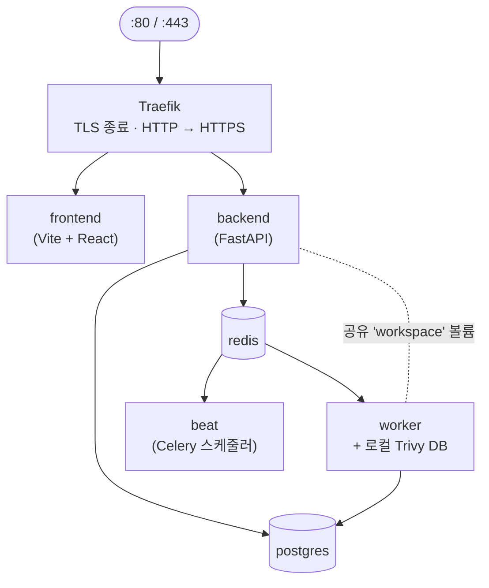

# 아키텍처

이 페이지는 TRUSCA가 내부적으로 어떻게 연결되어 있는지 설명합니다. 포털을 확장하거나 기존 플랫폼에 통합하거나 사내 아키텍처 리뷰에 비교하려고 한다면 여기서 시작하세요.

:::note 대상 독자
아키텍트, 플랫폼 엔지니어, 보안 리뷰어. FastAPI, PostgreSQL, Celery, Docker에 익숙해야 합니다.
:::

## 서비스

프로덕션 스택은 7개의 컨테이너 서비스를 실행합니다.

| 서비스 | 이미지 | 역할 |
|---|---|---|
| `traefik` | `traefik:v3.2.1` | 엣지 프록시. Let's Encrypt HTTP-01로 TLS 종료. HTTP→HTTPS 리다이렉트. |
| `postgres` | `postgres:17.2-alpine` | 주 저장소. 모든 영구 상태. |
| `redis` | `redis:7.4-alpine` | Celery 브로커 + 결과 백엔드. WebSocket pub/sub. |
| `backend` | `trustedoss/trusca-backend:<tag>` | FastAPI + uvicorn(4 workers). Traefik이 `/api`, `/health`로 라우팅. |
| `worker` | `trustedoss/trusca-backend-worker:<tag>` | `cdxgen`, scancode, Trivy, JRE가 번들된 Celery worker(JRE는 `cdxgen`의 Maven / Gradle SBOM 열거용). 워커는 `/var/lib/trivy`에 로컬 **Trivy DB**도 보관합니다. |
| `beat` | `trustedoss/trusca-backend-worker:<tag>` | Celery Beat 스케줄러. Trivy DB refresh(주간), 취약점 재매칭(refresh 후), 백업(매일). |
| `frontend` | `trustedoss/trusca-frontend:<tag>` | Vite 빌드를 nginx로 서비스. Traefik이 `/`로 라우팅. |

이미지 태그는 핀되어 있습니다(CLAUDE.md 규칙 #9 — `:latest` 절대 금지).

:::note v0.10.0에서 Dependency-Track 제거
이전 릴리스는 Dependency-Track을 선택적 8번째 서비스로 제공했습니다. v0.10.0은 Trivy를 단일 취약점 엔진으로 채택하면서 DT를 제거했습니다 — [ADR-0001](https://github.com/trustedoss/trusca/blob/main/docs/decisions/0001-replace-dt-with-trivy.md)과 [v0.10.0 릴리스 노트](../release-notes/v0.10.0.md) 참조. Trivy DB는 워커 컨테이너 내부에 존재하며, 별도의 취약점 엔진 서비스는 없습니다.
:::

:::note
이번 릴리스에는 백엔드 `/metrics` 핸들러가 마운트되어 있지 않으므로, `/metrics`는 Traefik 레벨(`docker-compose.yml`)에서도 라우팅하지 않습니다. Prometheus exporter와 해당 라우트는 GA 이후 로드맵 항목입니다.
:::

## 네트워크



호스트에 포트를 노출하는 것은 `traefik`(`80`, `443`)뿐입니다. 다른 모든 서비스는 compose 네트워크 내부에서만 접근 가능합니다.

## 데이터 레이아웃

PostgreSQL이 단일 진실 저장소입니다. 주요 테이블:

| 테이블 | 용도 |
|---|---|
| `users`, `teams`, `team_memberships` | 신원 + RBAC. |
| `api_keys` | 서비스 계정 자격증명(bcrypt 해시). |
| `projects` | 프로젝트당 한 행. 스캔·컴포넌트·발견을 소유. |
| `scans` | 스캔 라이프사이클 레코드(queued → terminal). |
| `components`, `component_licenses` | 스캔별 SBOM 행 + 라이선스 귀속. |
| `vulnerability_findings` | VEX 상태, justification, Trivy 제공 fixed-version 메타데이터 포함 CVE. |
| `obligations`, `obligation_kinds` | 컴포넌트별 라이선스 의무사항. |
| `approvals` | 조건부 라이선스 승인 워크플로. |
| `audit_log` | 추가 전용 쓰기 이력. CHECK 제약으로 immutable. |
| `webhook_deliveries` | 멱등성을 위한 `(source, delivery_id)`. |
| `notifications` | 아웃바운드 알림 로그 + dedup 키. |
| `backups` | 백업 manifest 이력(애플리케이션은 read-only). |

마이그레이션은 forward-only Alembic. 스키마와 데이터 마이그레이션은 별도 revision에 분리됩니다.

## 스캔 파이프라인

스캔은 Celery 태스크 체인입니다. 소스 스캔 단계(`apps/backend/tasks/scan_source.py` 참고):

```
1. bootstrap     (workspace 셋업, 프로젝트별 lock 획득)
2. fetch         (git clone / fetch / checkout)
3. prep          (workspace 레이아웃)
4. cdxgen        (cdxgen → CycloneDX SBOM + declared 라이선스)
5. scancode      (scancode가 first-party 소스 스캔 → detected 라이선스; best-effort)
6. sbom_upload   (CycloneDX SBOM을 workspace에 영속화, 매칭 준비)
7. vuln_match    (`trivy sbom`이 CycloneDX SBOM을 로컬 Trivy DB에 매칭)
8. finalize      (스캔당 단일 트랜잭션으로 PostgreSQL에 기록)
```

위 단계 슬러그는 `scan.<id>.progress` WebSocket 프레임으로 emit되어 UI가 라이브 진행 바를 렌더링합니다 — [사용자 가이드 — 스캔](../user-guide/scans.md#파이프라인-단계-source) 참고.

컨테이너 스캔 단계(`apps/backend/tasks/scan_container.py` 참고):

```
1. bootstrap
2. trivy         (OS 패키지 CVE 탐지)
3. persist       (PostgreSQL에 발견 기록)
4. finalize
```

단계 전환은 WebSocket 이벤트(`scan.<id>.progress`)를 emit해 UI가 실시간으로 업데이트됩니다. 완료 시 적절한 알림 트리거가 발사됩니다.

## 라이선스 단계 분류 {#ort-rules}

:::warning v0.10.0 의 분류 출처
v0.10.0 에서 라이선스 단계 분류는 ORT 룰 기반이 **아닙니다**. 단계
(`forbidden` / `conditional` / `permissive` / `unknown`)는
`apps/backend/tasks/scan_source.py` 의 하드코딩된
`_LICENSE_CATEGORY_DEFAULTS` 사전에서 옵니다. 레포의 `ort/rules.kts`
는  커스터마이징 경로를 위해 예약된 placeholder 입니다. v0.10.0
에서는 `ort/rules.kts` 를 수정해도 효과가 없습니다.
:::

분류기는 SPDX ID 를 단계로 다음과 같이 매핑합니다(대표적 부분 집합
— 표준 목록은 `_LICENSE_CATEGORY_DEFAULTS` 참고):

```python
_LICENSE_CATEGORY_DEFAULTS: dict[str, str] = {
    # forbidden
    "AGPL-3.0-only": "forbidden",
    "AGPL-3.0-or-later": "forbidden",
    "GPL-2.0-only":  "forbidden",
    "GPL-2.0-or-later": "forbidden",
    "GPL-3.0-only":  "forbidden",
    "GPL-3.0-or-later": "forbidden",
    "SSPL-1.0": "forbidden",
    "BUSL-1.1": "forbidden",
    # conditional
    "LGPL-2.1-only": "conditional",
    "LGPL-2.1-or-later": "conditional",
    "LGPL-3.0-only": "conditional",
    "LGPL-3.0-or-later": "conditional",
    "MPL-2.0": "conditional",
    "EPL-1.0": "conditional",
    "EPL-2.0": "conditional",
    "CDDL-1.0": "conditional",
    # ... permissive 항목 생략
}
# 조회는 정확 일치; 키가 없으면(접미사 없는 변형 "LGPL-3.0" 포함)
# "unknown" 으로 떨어지며 사람의 검토가 필요합니다.
```

현재 릴리스의 Operator 오버라이드 경로:

1. `apps/backend/tasks/scan_source.py` 의 `_LICENSE_CATEGORY_DEFAULTS` 패치.
2. worker 재빌드 및 재시작(`docker-compose restart worker beat`).
3. 영향받는 프로젝트를 재스캔해 새 분류 적용.

조직별 룰 커스터마이징은 예정입니다; 레거시 `ORT_RULES_PATH`
환경 변수와 worker 이미지의 `ort/rules.kts` 마운트는 제거된 ORT
단계에서 남은 잔재 placeholder 이며 v0.10.0 에서는 효과가 없습니다.

포털은 과거 스캔을 자동 재분류하지 않습니다 — 과거 기록은 스캔 시점에 유효했던 분류와 함께 보존됩니다.

## 취약점 매칭 (Trivy) {#trivy}

CVE 매칭은 Trivy를 직접 사용합니다 — 외부 엔진 없음. 워커 이미지에 `trivy` 바이너리가 포함되어 있고, Trivy DB(NVD + OSV + GHSA + EPSS + KEV 통합 번들)는 영속 볼륨의 `/var/lib/trivy/db/`에 존재합니다.

- **부팅 시 DB 다운로드** — Celery가 태스크를 받기 전에 `trivy --download-db-only`를 1회 실행.
- **주간 DB refresh** — Celery Beat 태스크가 최신 번들을 pull. 주기는 `TRIVY_DB_REFRESH_HOURS`(기본 `168`).
- **자동 재매칭** — 각 성공 refresh 후, beat 태스크가 모든 프로젝트의 최신 SBOM을 순회해 새 `vulnerability_findings` 행을 작성.
- **Air-gapped 운영** — `TRIVY_DB_REPOSITORY`로 업스트림 OCI 레지스트리를 사내 미러로 교체. 스캔별 매칭은 완전 오프라인.

운영자 라이프사이클은 [취약점 데이터 (Trivy DB)](../admin-guide/vulnerability-data.md), 출처별 매트릭스는 [데이터 출처](./data-sources.md) 참조.

## 인증 & 세션

- **비밀번호** — bcrypt cost 12, NIST 800-63B 차단 사전, 12자 이상, PII 재사용 금지.
- **Access token** — JWT, 30분 수명, `HS256` 서명(대칭, `SECRET_KEY`), 인앱 메모리 전용.
- **Refresh token** — 7일 수명, **회전 + 재사용 탐지**. HttpOnly + Secure + SameSite=Lax 쿠키.
- **API Key** — `tos_<prefix>_<secret>`은 `Authorization: Bearer …` 로 허용. bcrypt 해시 — 전체 Key는 생성 시 1회 표시.
- **CSRF 자세** — SPA는 bearer 토큰을 사용(구조상 CSRF 면역). refresh 쿠키는 HttpOnly + Secure + SameSite=Lax 로 별도의 CSRF 토큰 없이 cross-site POST 공격 클래스를 차단합니다. v0.10.0에는 별도 CSRF 토큰 엔드포인트가 없습니다.
- **레이트 리밋** — 로그인과 forgot-password에 IP 키 5/분, 429 + `Retry-After`. 비밀번호 재설정 이메일에는 주소별 쿨다운.

## 권한 (RBAC)

`super_admin`(조직), `team_admin`(팀별), `developer`(팀별). [사용자 및 팀 → 역할](../admin-guide/users-and-teams.md#역할) 참고.

요청의 effective role은 `(user, target_team)`에서 도출됩니다. 팀 간 API 호출은 403.

Admin 엔드포인트는 추가로 **404-existence-hide** 패턴(존재 은닉)을 사용합니다 — `developer`가 admin URL에 접근하면 403이 아닌 404를 받아 URL 표면을 열거할 수 없습니다.

## 오류 — RFC 7807

모든 4xx · 5xx 응답은 `application/problem+json`을 사용합니다.

```json
{
  "type":     "https://trustedoss.io/problems/last-super-admin",
  "title":    "Cannot demote the last super_admin",
  "status":   409,
  "detail":   "At least one super_admin must remain in the organization.",
  "instance": "/v1/admin/users/01H…/role"
}
```

도메인 특화 확장은 `snake_case`이며 OpenAPI에 모델링됩니다.

## 로깅

`structlog` JSON 라인, 한 라인 한 이벤트. 미들웨어가 `request_id`(`X-Request-ID` 또는 UUIDv7), `user_id`, `team_id`, (Celery에서) `task_id`를 시드합니다. PII는 emit 전 `mask_pii` 헬퍼로 마스킹됩니다 — 비밀번호·토큰·API Key·전체 이메일 주소는 절대 로그에 나타나지 않습니다.

## 관측성

기본 제공:

- **로그** — `docker-compose logs <service>`(구조화 JSON, `structlog`).
- **Health** — `/health`(backend), `/healthz`(frontend 컨테이너), 운영자 대시보드용 `/admin/health` UI.
- **Metrics** — 기본 서비스-헬스 메트릭은 Traefik 액세스 로그를 통해 제공됩니다. Prometheus exporter가 있는 백엔드 `/metrics` 엔드포인트는 GA 이후 로드맵 항목입니다.

OpenTelemetry tracing exporter와 번들 Jaeger 오버레이는 GA 이후 로드맵(Phase B) 항목이며 — v0.10.0에는 `docker-compose.tracing.yml` 파일이 없습니다.

## 배포 토폴로지

표준 배포는 **단일 호스트 docker-compose** 설치입니다. 변형:

- **단일 호스트 (기본)** — 위 7개 서비스. Trivy DB는 워커 부팅 시 다운로드.
- **Air-gapped** — `TRIVY_DB_REPOSITORY`를 사내 OCI 미러로 지정해 워커가 공개 레지스트리에 절대 접근하지 않도록 함. [취약점 데이터 — Air-gapped 운영](../admin-guide/vulnerability-data.md#air-gapped) 참조.

**Helm chart**는 v0.10.0부터 제공됩니다. v0.10.0 차트 0.10.0은 다음을 추가:

- 컴포넌트별 HPA(worker는 큐 깊이로 스케일).
- PVC가 있는 PostgreSQL StatefulSet.
- Prometheus operator용 ServiceMonitor.
- TLS용 Ingress + cert-manager.

다중 호스트 docker-compose(예: 별도 머신의 worker)는 기술적으로는 가능하지만 지원 경로가 아닙니다 — 그 규모에는 Helm chart를 사용하세요.

## 백업 모델

데이터베이스는 `pg_dump --clean --if-exists | gzip`, workspace는 `tar.gz`, 그리고 Alembic head를 담은 manifest. 전체 절차는 [백업·복원](../admin-guide/backup-and-restore.md) 참고.

## 보안 자세 요약

- Apache-2.0 라이선스. GA 시점에 SBOM 발행.
- Phase 8에서 OWASP Top 10 리뷰(`security-reviewer` 에이전트 + 수동 감사).
- 의존성은 `pip-tools`(backend)와 `package-lock.json`(frontend)으로 핀. CI에서 `pip-audit`와 `npm audit` 실행.
- 모든 이미지 빌드에 Trivy 스캔.
- 프로덕션 TLS 전용(Traefik이 HTTPS 강제).
- 비밀값은 절대 로그에 남기지 않음. `mask_pii`는 테스트 fixture로 강제.

## 함께 보기

- [환경 변수](./env-variables.md)
- [API 개요](./api-overview.md)
- [취약점 데이터 (Trivy DB)](../admin-guide/vulnerability-data.md)
- [데이터 출처](./data-sources.md)
- [용어집](./glossary.md)
