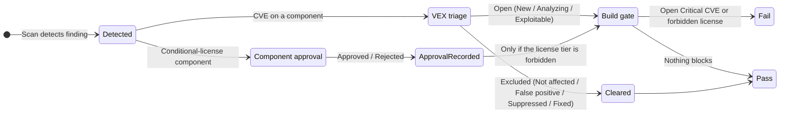

# 분류

**분류(Triage)**는 원시 스캔 결과가 결정으로 바뀌는 단계입니다. TRUSCA에는 세 가지 분류 표면이 있고 각각 별도 페이지에 자세히 설명되어 있습니다. CVE를 다루는 **VEX 취약점 분류**, 조건부 라이선스 컴포넌트를 다루는 **컴포넌트 승인**, 그리고 이 결정들을 CI의 통과/차단으로 바꾸는 **빌드 차단 게이트**입니다. 이 페이지는 셋을 하나로 묶는 지도입니다. 하나의 발견 항목이 세 표면을 어떻게 거치는지를 한곳에서 보여 주며, 그만큼 중요한 **어떤 결정이 실제로 빌드 차단 게이트에 도달하고 어떤 결정은 그렇지 않은지**를 함께 정리합니다.

VEX(Vulnerability Exploitability eXchange)는 CVE가 제품에 실제로 영향을 주는지 기록하는 표준 어휘입니다. CVE(Common Vulnerabilities and Exposures)는 알려진 취약점의 공식 식별자입니다.

:::note 대상 독자
발견 항목을 분류하며 그 결정이 CI에 어떻게 영향을 주는지 이해해야 하는 엔지니어와 팀 리더. VEX 결정 기록은 `developer` 이상이 필요하며, 컴포넌트 승인 처리와 발견 항목을 `Suppressed`로 옮기는 작업은 `team_admin`이 필요합니다.
:::

## 세 가지 분류 표면 {#surfaces}

각 표면은 서로 다른 종류의 결정을 담당합니다. 전체 상태 머신·권한·API는 연결된 페이지를 참고하십시오. 이 페이지는 셋이 어떻게 이어지는지만 보여 줍니다.

| 표면 | 적용 대상 | 기록되는 결정 | 빌드 차단 게이트에 도달? |
|---|---|---|---|
| [VEX 취약점 분류](./vulnerabilities.md#vex-상태-머신) | 컴포넌트의 CVE 발견 항목 | 발견 항목의 악용 가능성 결정 (신규 → 분석 중 → 종료 VEX 상태) | **예** — 제외 상태는 Critical CVE 집계에서 빠집니다 |
| [컴포넌트 승인](./approvals.md#상태-머신) | 조건부 라이선스(LGPL, MPL, EPL, CDDL)를 보유한 컴포넌트 | 컴포넌트의 라이선스 사용 승인 여부 (대기 → 검토 중 → 승인 / 반려) | **아니요** — 게이트는 승인 결정을 읽지 않습니다([caveat](#approval-does-not-gate) 참고) |
| [빌드 차단 게이트](./vulnerabilities.md#심각도-모델) | 프로젝트의 최근 성공 스캔 | CI 통과 / 차단 | 게이트 자체가 결과입니다 — VEX 결정과 `forbidden` 라이선스 단계를 읽습니다 |

## 발견 항목의 흐름 {#flow}

발견 항목은 스캔이 탐지하는 순간 분류에 진입합니다. 경로는 발견 항목의 종류에 따라 갈립니다. 취약점이냐 조건부 라이선스 컴포넌트냐에 따라 다르며, 두 경로는 빌드 차단 게이트에서만 합쳐집니다.

두 경로는 설계상 독립적입니다.

- **CVE 발견 항목**은 [VEX 결정](./vulnerabilities.md#vex-상태-머신)으로 분류합니다. 모든 발견 항목은 `New`에서 시작해 `Analyzing`을 거쳐 종료 상태에 도달합니다. 네 가지 *제외* 상태(`Not affected`, `False positive`, `Suppressed`, `Fixed`)는 발견 항목을 빌드 차단 게이트 집계에서 빼고, *열린* 상태(`New`, `Analyzing`, `Exploitable`)는 계속 집계합니다. 여러 발견 항목이 같은 결정을 공유하면 드로어를 하나씩 열지 말고 [일괄 전환](./vulnerabilities.md#bulk-transition)하십시오.
- **조건부 라이선스 컴포넌트**는 이와 나란히 [컴포넌트 승인](./approvals.md#상태-머신) 요청을 만듭니다. 검토자가 승인하거나 반려하고 결정은 감사용으로 기록되지만, 게이트는 이 결정을 참조하지 않습니다(아래 참고).

## 각 결정이 빌드 차단 게이트에 도달하는 지점 {#gate-reach}

세 표면이 가장 자주 혼동되는 지점이 바로 여기입니다. [빌드 차단 게이트](./vulnerabilities.md#심각도-모델)는 정확히 두 조건에서 빌드를 차단합니다.

1. 열린 **Critical CVE**가 하나 이상 있거나(설정된 심각도 임계에서 아직 열린 VEX 상태인 발견 항목), 또는
2. 라이선스가 **`forbidden`** 단계로 해석되는 컴포넌트가 하나 이상 있음.

VEX 분류는 조건 1에 직접 반영됩니다. 발견 항목을 제외 상태로 옮기면 다음 스캔에서 집계에서 빠집니다. 컴포넌트 승인은 두 조건 **어느 쪽에도** 반영되지 않습니다.

### 컴포넌트 승인은 빌드를 차단하지 않습니다 {#approval-does-not-gate}

:::warning
**반려(Rejected)**된 컴포넌트 승인은 빌드를 차단하지 **않습니다**. 게이트는 `forbidden` 라이선스 단계만 평가하며(`apps/backend/services/policy_gate.py`), 승인 결정은 절대 읽지 않습니다. 반려된 컴포넌트는 다음 스캔에서도 `conditional`로 분류되고 빌드는 진행됩니다. 전체 설명과 수동 후속 조치(의존성 제거 또는 라이선스를 `forbidden`으로 승격)는 [반려 결정 caveat](./approvals.md#rejected-verdict)를 참고하십시오.
:::

라이선스가 실제로 CI를 차단하게 하려면 승인 결정이 아니라 라이선스 단계를 바꾸십시오. 팀은 [라이선스 정책](../reference/license-policies.md#동적-게이트-평가)을 통해 재배포 없이 런타임에 라이선스를 `forbidden`으로 승격할 수 있습니다. Critical이 아닌 CVE가 CI를 차단하게 하려면 [EPSS 빌드 차단 게이트 차원](../ci-integration/github-actions.md#epss로-빌드-게이팅-선택)을 추가하십시오.

:::note 게이트는 하나, 최근 스캔만
게이트는 항상 프로젝트의 **최근 성공 스캔**을 반영합니다. 지금 기록한 분류 결정은 UI에 즉시 나타나지만 게이트 판정은 다음 스캔에서만 바뀝니다. 분류 시점에 스캔이 이미 실행 중이었다면 그 스캔은 이전 상태를 담고 있으므로, 다시 평가하려면 새 스캔을 트리거하십시오.
:::

## 정상 동작 확인

각 종류의 발견 항목을 하나씩 해당 표면에 통과시키고, 게이트가 VEX 경로는 읽되 승인 경로는 읽지 않는지 확인하십시오.

<!-- docs-uat: id=triage-vex-to-gate kind=manual tier=manual -->
1. **Vulnerabilities** 탭에서 열린 Critical CVE를 `Not affected`로 옮깁니다. 상태 배지가 즉시 갱신됩니다(아래 VEX 하네스가 검증하는 것과 같은 전환). 다음 스캔에서 [빌드 차단 게이트](./vulnerabilities.md#심각도-모델)의 Critical CVE 집계가 하나 줄어듭니다.
<!-- docs-uat: id=triage-vex-badge kind=ui harness=vulnStatusUpdates(portal-web) tier=nightly -->
2. VEX 상태 배지가 페이지 새로고침 없이 새 상태를 반영합니다.
<!-- docs-uat: id=triage-approval-not-gated kind=manual tier=manual -->
3. 조건부 라이선스 컴포넌트의 승인을 반려한 뒤 다시 스캔합니다. 빌드 게이트 판정은 **바뀌지 않으며** — 승인이 게이트에 도달하지 않음을 확인 — [Approvals](./approvals.md) 큐와 감사 로그는 모두 반려 결정을 기록합니다.

## 트러블슈팅

### 반려한 컴포넌트가 CI를 차단하지 않음

의도된 동작입니다. 컴포넌트 승인은 게이트에 도달하지 않습니다. [컴포넌트 승인은 빌드를 차단하지 않습니다](#approval-does-not-gate)를 참고하십시오. [라이선스 정책](../reference/license-policies.md#동적-게이트-평가)으로 라이선스를 `forbidden`으로 승격하거나 의존성을 제거해 차단하십시오.

### 억제한 CVE가 여전히 게이트에 집계됨

게이트는 **최근 성공 스캔**을 반영합니다. 그 스캔 이후에 기록한 VEX 결정은 다음 스캔에만 적용됩니다. 새 스캔을 트리거한 뒤 게이트를 다시 확인하십시오. 발견 항목이 *제외* VEX 상태(`Not affected`, `False positive`, `Suppressed`, `Fixed`)에 도달했는지도 확인하십시오. *열린* 상태는 계속 집계됩니다. [VEX 상태 머신](./vulnerabilities.md#vex-상태-머신)을 참고하십시오.

### 관심 있는 Critical이 아닌 CVE가 빌드를 차단하지 않음

게이트는 기본적으로 Critical CVE와 금지 라이선스에서만 차단합니다. 심각도와 무관하게 악용 확률이 높은 CVE가 차단되도록 EPSS 차원을 추가하십시오. [EPSS로 빌드 차단하기](../ci-integration/github-actions.md#epss로-빌드-게이팅-선택)를 참고하십시오.

## 함께 보기

- [취약점](./vulnerabilities.md) — 전체 VEX 상태 머신, 심각도 모델, 일괄 전환
- [승인](./approvals.md) — 컴포넌트 승인 워크플로우와 반려 결정 caveat
- [GitHub Actions](../ci-integration/github-actions.md) — 빌드 차단 게이트를 CI에 연결
- [라이선스 정책](../reference/license-policies.md) — 라이선스 단계를 바꿔 실제로 게이트가 걸리게 하기
