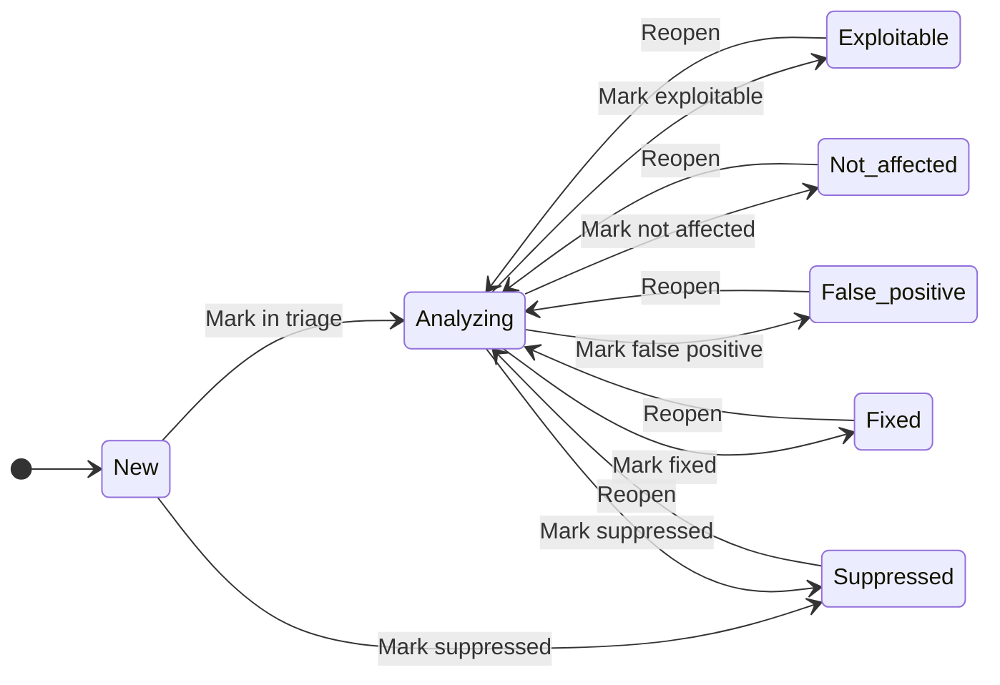

# 취약점

**Vulnerabilities** 탭은 스캔 파이프라인이 프로젝트 컴포넌트와 상관시킨 모든 미해결 CVE(Common Vulnerabilities and Exposures)를 나열합니다. 결과는 스캔을 거쳐 영속화됩니다 — CVE가 한번 발견되면 근본 컴포넌트가 제거·업그레이드될 때까지 상태와 분류 노트와 함께 프로젝트 이력에 남습니다.


:::note 대상 독자
개별 결과를 분류하는 엔지니어; SLA를 추적하는 보안 리드. VEX 상태 변경은 `developer` 이상; 일괄 억제는 `team_admin`.
:::

## "Vulnerability data unavailable" 배너 {#vuln-data-unavailable-banner}

Vulnerabilities 탭 상단에 파란색 **Vulnerability data unavailable** 배너가 나타나는 경우는, 포털이 스캔에서 발견한 *컴포넌트* 는 보여줄 수 있지만 finding 이 0 건일 때 — 보통 로컬 Trivy DB의 다운로드가 아직 끝나지 않았거나(워커가 막 부팅한 신규 배포), DB 다운로드가 실패한 경우입니다. 배너는 원인을 설명하고 다음 절차를 안내합니다.

- 관리자는 워커 디스크의 Trivy DB를 확인해야 합니다 — 정확한 명령은 [취약점 데이터 — 동작 확인](../admin-guide/vulnerability-data.md#동작-확인) 참조. 곧 도착할 `/admin/health` 하위의 **Vulnerability data** 카드(roadmap)가 UI에서 신선도를 노출합니다.
- Trivy DB가 자리 잡으면 자동 재매칭 beat이 모든 프로젝트의 최신 SBOM에서 finding을 가져옵니다 — 사용자 측 인앱 액션은 필요 없습니다. 배너는 적어도 한 건의 finding이 반환되는 다음 페이지 로드에서 자동으로 사라집니다.

배너는 *정보성* 이지 에러가 아닙니다 — 실제로 깨끗한 프로젝트의 `0 findings` 는 API 레벨에서 동일하게 보이므로, 메시지는 의도적으로 단정하지 않고 진단 표면을 가리킵니다.

## 심각도 모델

| 심각도 | 색상 토큰 | CVSS v3 (일반) | 빌드 게이트 |
|---|---|---|---|
| **Critical** | `#dc2626` | 9.0–10.0 | 종료 코드 1(기본) |
| **High** | `#ea580c` | 7.0–8.9 | 프로젝트별 설정 |
| **Medium** | `#ca8a04` | 4.0–6.9 | 영향 없음 |
| **Low** | `#2563eb` | 0.1–3.9 | 영향 없음 |
| **Info** | `#71717a` | — | 영향 없음 |

기본 정책은 `Critical`에서만 빌드를 실패시킵니다. 프로젝트 소유자는 임계치를 `High`로 낮출 수 있습니다.

## VEX 상태 머신

결과는 [CycloneDX VEX(Vulnerability Exploitability eXchange)](https://cyclonedx.org/capabilities/vex/) 7-state 모델을 따릅니다. 각 결과는 **신규**에서 시작하며 분석가가 분류함에 따라 전환됩니다.



| 상태 | 정의 | 빌드 게이트 |
|---|---|---|
| **신규 (New)** | 막 발견됨; 분류되지 않음. | 카운트. |
| **분석 중 (Analyzing)** | 분류 진행 중. | 카운트. |
| **악용 가능 (Exploitable)** | 이 프로젝트 맥락에서 악용 가능 확인. | 카운트. |
| **해당 없음 (Not affected)** | 컴포넌트는 있으나 취약 코드 경로에 도달 불가. | 제외. |
| **오탐 (False positive)** | 탐지 자체가 잘못됨(예: 잘못된 purl). | 제외. |
| **억제됨 (Suppressed)** | 운영자가 명시적으로 침묵 처리(`not_affected` + 명시적 억제). | 제외. |
| **수정됨 (Fixed)** | 해결됨(컴포넌트 업그레이드 또는 패치 적용). | 제외. |

전환은 행위자, `previous_status`, `new_status`, 필수 사유 메시지와 함께 감사 로그에 기록됩니다.

### 필수 사유

`New` / `Analyzing` 외 상태로 전환할 때마다 자유 텍스트 사유(10자 이상)가 필요합니다. 포털은 사유를 그대로 저장합니다 — 사실 기반으로 작성하세요("lodash를 4.17.21로 업그레이드", "취약 코드 경로는 `dev_only` 모듈에 있음"). 본 텍스트는 CycloneDX VEX 출력에 그대로 노출됩니다.

## 결과 테이블

컬럼:

- **CVE** — CVE-YYYY-NNNN 식별자 (평문 표시; NVD 클릭 이동은 로드맵 항목).
- **심각도 (Severity)** — 색상 배지.
- **CVSS** — 상위 피드의 CVSS v3 숫자 점수.
- **EPSS** — EPSS 확률을 백분율로 표시(예: `97.3%`). EPSS 값이 없는 CVE는 `—`로 표시됩니다. [EPSS — 악용 확률](#epss--악용-확률) 참고.
- **제목 (Title)** — 권고문의 짧은 요약.
- **영향 (Affected)** — 영향 받는 컴포넌트(`name@version`).
- **상태 (Status)** — 현재 VEX 상태.
- **발견 시각 (Discovered)** — 결과가 처음 등장한 시점.

상단 인라인 필터 바: 심각도, 상태, **EPSS 임계** 필터(`min_epss`), 그리고 **검색** 박스(CVE ID / 제목 / 컴포넌트 자유 텍스트), 정렬·정렬 순서 컨트롤. 정렬 컨트롤에는 **EPSS**(`sort=epss`)가 포함되며, EPSS 값이 없는 행은 마지막으로 정렬됩니다.

## 드로어 — 결과 상세

행을 클릭하면 다음을 봅니다.

- **요약 (Summary)** — 제목, 설명, CWE, CVSS 벡터, 그리고 Trivy DB가 제공할 때의 **EPSS score와 percentile**(미제공 시 `—`). [EPSS — 악용 확률](#epss--악용-확률) 참고.
- **참고 자료 (References)** — 벤더 권고, 수정 커밋, 익스플로잇 데이터베이스.
- **영향 (Affected)** — 상위에서 보고한 영향 범위와 본 프로젝트 컴포넌트 버전 강조, 그리고 **수정 버전(fixed version)** — *이 컴포넌트*에 대해 *이 CVE*를 해소하는 버전 — 을 스캔 파이프라인이 판별할 수 있었던 경우 표시합니다. [수정 버전 — CVE를 해소하는 버전](#수정-버전--cve를-해소하는-버전) 참고. 영향 컴포넌트는 **의존성 깊이**()도 함께 표시합니다: 직접 선언한 **직접(direct)** 의존성(깊이 `1`)인지, 다른 패키지가 끌어온 **전이(transitive)** 의존성(깊이 `2+`)인지. 직접 의존성의 CVE 는 대개 선언 버전을 올려 본인이 고치고, 전이 의존성의 CVE 는 그것을 요구하는 직접 부모를 업그레이드해 고칩니다 — [직접 vs. 전이 (의존성 깊이)](./components-and-licenses.md#dependency-depth) 참고.
- **분석 (Analysis)** — VEX 상태 전환별 액션 버튼, 현재 상태에서 허용된 전환마다 한 개씩 표시됩니다. 모든 종결 결정은 `analyzing` 상태를 거치므로 새로 발견된 finding 은 곧바로 verdict 로 넘어갈 수 없습니다. 버튼을 클릭하면 사유 입력 다이얼로그가 열리며 제출합니다. `developer` 이상만 가능하며, `Suppressed` 로의 전이는 `team_admin` 이상이 필요합니다.
- **이력 (History)** — VEX 상태 전환 타임라인(누가, 언제, 어떤 사유로 상태를 변경했는지).


### 워크스루 — Vulnerabilities 탭 진입 + 드로어 열기

아래 워크스루는 프로젝트를 열고 **Vulnerabilities** 탭으로 전환한 뒤 첫 번째 행을 클릭해 트리아지 준비가 된 Analysis 섹션이 있는 드로어를 표시합니다.

<video controls width="100%" preload="metadata" poster="/img/walkthroughs/walkthrough-cve-triage.gif">
  <source src="/img/walkthroughs/walkthrough-cve-triage.mp4" type="video/mp4" />
  
</video>

## 일괄 상태 전이 {#bulk-transition}

여러 finding 이 같은 디스포지션을 공유할 때 — 예를 들어 방금 업그레이드한 동일 라이브러리의 10 개 finding — 툴바의 **Bulk action bar** 로 드로어를 일일이 열지 않고 한 번에 전이할 수 있습니다.


1. 행 단위 체크박스(또는 헤더 트라이-스테이트 체크박스로 현재 페이지의 모든 행 선택 — 필터·페이지가 변경되면 선택이 자동으로 클리어되어 stale 선택이 뷰를 건너 leak 되지 않음) 를 체크합니다.
2. 표 상단의 액션 바가 선택 개수와, 선택된 행들의 *공통* 현재 상태에서 가능한 verdict 들을 보여줍니다. 선택이 상태를 섞어 합법적 다음 상태의 교집합이 비면 verdict 버튼이 비활성화되고 툴팁이 이유를 설명합니다.
3. verdict 를 선택하고 justification 을 한 번만 입력(같은 텍스트가 모든 행에 적용)한 뒤 submit.

응답은 **행 단위** 입니다 — 선택된 모든 finding 이 결과 alert 에 상태 항목을 받습니다 — `transitioned`(상태 변경), `already_at_target`(스킵, no-op), 혹은 `illegal_transition` / `forbidden_transition` 같은 명시적 사유. alert 가 닫히면 표가 새 상태를 반영하며 reload 됩니다.

서버 쪽에서 요청은 선택된 finding id 목록·target status·justification 을 담은 단일 `POST /v1/projects/{id}/vulnerabilities:bulk-transition` 호출입니다. 엔드포인트는 행 단위 엔드포인트와 동일한 상태 머신 가드를 적용하며, 실제 전이된 finding 당 audit-log 행 1 개를 emit 합니다. 한 호출 당 상한은 **200 ids** 입니다 — 그보다 큰 선택은 페이지를 넘기며 청크 단위로 submit 하세요.

:::caution Suppressed 전이는 여전히 `team_admin` 권한 필요
bulk 엔드포인트는 행 단위 엔드포인트의 권한을 **확장하지 않습니다**. 선택된 *어느* 행이라도 `Suppressed` 로 옮기려면 여전히 프로젝트 팀의 `team_admin` (또는 그 이상) 권한이 필요합니다 — `developer` 가 `→ Suppressed` 전이를 포함한 bulk 요청을 submit 하면 해당 행들은 `forbidden_transition` 으로 보고되고, 같은 submit 의 다른 행들은 정상 완료됩니다.
:::

## EPSS — 악용 확률

포털은 [EPSS(Exploit Prediction Scoring System)](https://www.first.org/epss/) score를 CVSS 옆에 노출해, *심각한* CVE와 *실제 공격받을 가능성이 높은* CVE를 구분할 수 있게 합니다.

### EPSS vs. CVSS — 각각 무엇을 답하나

- **CVSS**는 **심각도**를 측정합니다 — CVE가 악용되었을 때의 이론적 영향. 누군가 실제로 악용하는지, 할 것인지는 말하지 않습니다.
- **EPSS**는 향후 30일 내 **실제 악용 확률**을 `0`~`1` 사이의 숫자로 측정합니다.

둘은 보완 관계입니다. CVSS `9.8`(Critical)인데 EPSS는 `0.01`인 CVE — 문서상으로는 심각하지만 공격받을 예측 확률은 낮은 — 가 흔합니다. EPSS로 정렬·필터하면 *실제로* 위험한 소수의 결과에 집중하고 노이즈를 줄일 수 있습니다.

:::caution EPSS는 best-effort
EPSS 데이터는 Trivy DB에서 옵니다 — **Trivy가 EPSS 값을 제공하는 CVE에 한해서만** 존재합니다. EPSS 값이 없는 결과는 UI에서 `—`, API에서 `null`로 표시됩니다 — 누락된 EPSS는 "낮음"이 아니라 "알 수 없음"으로 다루세요. EPSS는 CVSS나 VEX 분류를 대체하지 않으며, 하나의 추가 신호입니다.
:::

### 포털의 EPSS 표시 방식

- **Score** — 백분율로 렌더링. EPSS `0.973`은 `97.3%`로 표시됩니다.
- **Percentile** — "상위 N%"로 렌더링. 99번째 백분위수의 결과는 대략 "상위 1%"로 표시되며, 그 점수가 전체 채점된 CVE의 약 99%보다 높음을 뜻합니다.
- **누락** — `—` (Trivy DB가 해당 CVE에 EPSS 값을 제공하지 않음).

score와 percentile은 결과 테이블의 **EPSS** 컬럼과 드로어의 **요약(Summary)** 섹션에 나타납니다.

### EPSS 정렬·필터

- **정렬** — 툴바 정렬 컨트롤에서 **EPSS**를 선택(내림차순이면 가장 악용 가능성 높은 결과가 위로). EPSS 값이 없는 결과는 정렬 순서와 무관하게 항상 마지막으로 정렬됩니다(`NULLS LAST`).
- **필터** — **EPSS 임계**(`min_epss`, `0`~`1` 값)를 설정하면 `epss_score >= min_epss`인 결과만 표시합니다. 예를 들어 `min_epss=0.5`는 모델이 악용 확률 50% 미만으로 예측한 모든 결과를 숨깁니다. EPSS 값이 없는 결과는 임계 필터에서 제외됩니다(누락된 score는 `>=`를 만족할 수 없음).

### API에서 EPSS 읽기

`GET /v1/projects/{id}/vulnerabilities`는 모든 결과에 `epss_score`와 `epss_percentile`을 반환합니다(Trivy DB가 값을 제공하지 않으면 둘 다 `null`). 동일한 필드가 결과 상세(`GET /v1/vulnerability_findings/{finding_id}`)와 중첩된 `VulnerabilityRef`에도 나타납니다.

EPSS로 정렬, 높은 순:

```bash
curl -sS \
  -H "Authorization: Bearer ${TRUSTEDOSS_API_KEY}" \
  "https://trustedoss.example.com/v1/projects/${PROJECT_ID}/vulnerabilities?sort=epss&order=desc"
```

모델이 악용 확률 50% 이상으로 예측한 결과만 반환:

```bash
curl -sS \
  -H "Authorization: Bearer ${TRUSTEDOSS_API_KEY}" \
  "https://trustedoss.example.com/v1/projects/${PROJECT_ID}/vulnerabilities?min_epss=0.5"
```

응답의 한 결과는 다음과 같습니다(그 외 필드 생략).

```json
{
  "cve_id": "CVE-2021-44228",
  "severity": "critical",
  "cvss_score": 10.0,
  "epss_score": 0.974,
  "epss_percentile": 0.999,
  "status": "new"
}
```

:::tip EPSS로 빌드 게이팅
EPSS는 CI 빌드 게이트도 구동할 수 있어, Critical이 아니어도 악용 확률이 높은 CVE가 빌드를 실패시킬 수 있습니다. [EPSS로 빌드 게이팅](../ci-integration/github-actions.md#epss로-빌드-게이팅-선택) 참고.
:::

## 수정 버전 — CVE를 해소하는 버전

결과 드로어의 **영향(Affected)** 섹션은 영향 받는 각 컴포넌트 옆에 **수정 버전(fixed version)** 을 표시합니다. *그 컴포넌트*를 어느 버전으로 올리면 *그 CVE*를 더 이상 가지지 않는지 알려줍니다 — 모든 트리아지 담당자가 가장 먼저 묻는 "무엇으로 올리면 되나?"에 답합니다.

### CVE 단위가 아니라 (컴포넌트 × CVE) 단위입니다

하나의 CVE라도 **패키지마다 서로 다른 버전에서 패치**되는 경우가 흔하고, 하나의 패키지라도 **CVE마다 서로 다른 버전에서 패치**될 수 있습니다. 따라서 수정 버전은 CVE 전역이 아니라 개별 결과(즉 `(컴포넌트, CVE)` 쌍)에 저장됩니다. 같은 CVE에 영향받는 두 컴포넌트가 서로 다른 수정 버전을 보이는 것은 정상이며, 버그가 아닙니다.

### 데이터 출처

스캔 파이프라인은 **Trivy DB 결과(findings)** 로부터 다음 우선순위로 수정 버전을 수집합니다.

1. Trivy가 결과에 첨부한 **구조화된 패치 버전 목록**(가장 낮은 패치 버전 채택).
2. `status: fixed`로 표시된 **CycloneDX VEX `affects[].versions[]`** 항목.
3. 권고문의 자유 텍스트 **recommendation**("Upgrade to 2.17.1 or later")에서 구체적 버전을 추출.

수집된 문자열은 저장 전에 검증됩니다 — 제어 문자, 과도한 길이, 범위 연산자(`^`, `>=`), 그리고 그럴듯한 버전 토큰이 아닌 값은 저장하지 않고 "알 수 없음"으로 처리합니다.

### 비어 있을 때

다음의 경우 수정 버전은 `—`로 표시(API는 `null` 반환)됩니다.

- Trivy DB가 이 컴포넌트/CVE에 대한 수정을 보고하지 않은 경우(상위 권고에 아직 패치 버전이 없음 — 실제 제로데이거나 아직 미수정 CVE), **또는**
- 해당 결과가 이 수집 기능을 도입한 ** 이전** 스캔에서 발견된 경우. 프로젝트를 재스캔하면 채워집니다.

수정 버전이 비어 있다는 것은 "수정이 존재하지 않는다"가 아니라 **"알려진 수정 버전이 없다"** 는 의미입니다 — CVE가 수정 불가하다고 결론짓기 전에 항상 상위 권고를 확인하세요.

### API로 읽기

수정 버전은 결과 상세의 영향 컴포넌트와 컴포넌트 드로어의 중첩 CVE 참조에 `fixed_version`으로 노출됩니다.

```bash
# 결과 상세 — 각 영향 컴포넌트의 fixed_version
curl -sS \
  -H "Authorization: Bearer ${TRUSTEDOSS_API_KEY}" \
  "https://trustedoss.example.com/v1/vulnerability_findings/${FINDING_ID}"
```

```json
{
  "cve_id": "CVE-2021-44228",
  "affected_components": [
    {
      "name": "log4j-core",
      "version": "2.14.1",
      "purl": "pkg:maven/org.apache.logging.log4j/log4j-core@2.14.1",
      "fixed_version": "2.17.1"
    }
  ]
}
```

:::note 업그레이드 추천이 이 위에 쌓입니다
수정 버전은 **업그레이드 추천(권장 버전)**()의 입력입니다. 각 결과가 수정 버전을 알게 되면, 포털은 컴포넌트별 최소한의 안전한 업그레이드를 계산합니다. [업그레이드 추천(권장 버전)](#업그레이드-추천권장-버전) 참고.
:::

## 업그레이드 추천(권장 버전)

[수정 버전](#수정-버전--cve를-해소하는-버전)이 "*이* CVE를 무엇이 패치하나"에 답한다면, **권장 버전(recommended version)** 은 그다음 질문 — "이 컴포넌트를 어느 한 버전으로 올리면 깨끗해지나?"에 답합니다. 이것은 **최소 안전 업그레이드(minimum safe upgrade)** 입니다: 그 컴포넌트의 미해결 CVE를 **모두** 한 번에 해소하는 가장 낮은 버전.

결과 드로어는 이를 참조·영향 컴포넌트 위의 **권장 업그레이드** 패널에 표시합니다.

### 계산 방식

하나의 컴포넌트가 여러 미해결 CVE를 가질 수 있고, 각 CVE는 저마다의 버전에서 수정됩니다. 권장 버전은 그 CVE별 [수정 버전](#수정-버전--cve를-해소하는-버전)들의 **시맨틱 버전 최댓값** — 개별 수정 버전 모두 이상이 되는 가장 낮은 버전 — 입니다.

- 컴포넌트 `log4j-core@2.14.1`에 미해결 CVE 두 개가 각각 `2.16.0`, `2.17.1`에서 수정됩니다. 권장 버전은 **`2.17.1`** — 이 버전으로 올리면 둘 다 해소됩니다.

**미해결** 결과만 계산에 포함됩니다. 이미 디스포지션한 CVE(`영향 없음`, `오탐`, `수정됨`)는 제외됩니다 — [빌드 게이트](#심각도-모델)가 보는 집합과 정확히 동일하므로, 추천이 이미 닫은 CVE를 좇으라고 하지 않습니다.

### 우선순위 신호

패널은 "지금 고칠 것"과 "나중에 고칠 것"을 구분할 수 있도록 세 가지 신호도 함께 노출합니다.

- **직접 의존성** — 직접 선언한 컴포넌트(그래프 깊이 `1`)이므로 본인 매니페스트에서 즉시 버전을 올릴 수 있습니다. 전이 의존성은 배지가 없습니다 — 그것을 끌어오는 직접 부모를 업그레이드해 고칩니다([직접 vs. 전이](./components-and-licenses.md#dependency-depth) 참고).
- **최고 심각도** — 컴포넌트의 미해결 결과 중 가장 심각한 CVE.
- **최고 EPSS** — 그중 가장 높은 [악용 확률](#epss--악용-확률).

이 신호들은 추천의 **정렬**(직접·고EPSS·심각 업그레이드를 먼저)에 쓰일 뿐, 권장 *버전* 자체를 바꾸지 않습니다.

### 추천이 없을 때

포털은 오해를 부르는 부분 업그레이드를 권하기보다, 일부러 추천을 보류하고 이유를 밝힙니다.

- **알려진 수정 버전 없음** — 컴포넌트의 미해결 CVE 중 하나 이상이 [수정 버전](#수정-버전--cve를-해소하는-버전)을 갖지 않습니다(진짜 제로데이이거나  이전 스캔 결과). *알려진* 수정의 최댓값으로 올리면 컴포넌트가 완전히 깨끗하다고 잘못 암시하므로, 대신 "추천 불가" 안내를 표시합니다.
- **해석 불가한 수정 버전** — 사용 가능한 모든 수정 문자열이 비정상이라 비교할 수 없었습니다.

"추천 불가" 상태는 오류가 아니라 정보입니다 — 미해결 CVE를 상위 권고에서 확인하세요.

### CI 빌드 게이트 코멘트에서

[빌드 게이트](../ci-integration/github-actions.md)가 게시하는 SCA PR 코멘트에는 우선순위가 높은 업그레이드(직접·심각 순)를 나열하는 **Recommended upgrades** 섹션이 포함됩니다. 각 항목은 `컴포넌트 현재 → 권장`과 해소하는 CVE를 함께 보여주며, 실행 가능한 업그레이드가 하나라도 있을 때만 표시됩니다.

### API에서 읽기

결과 상세(`GET /v1/vulnerability_findings/{finding_id}`)는 `upgrade_recommendation` 객체를 함께 반환합니다.

```json
{
  "cve_id": "CVE-2021-44228",
  "upgrade_recommendation": {
    "recommended_version": "2.17.1",
    "reason": "ok",
    "direct": true,
    "max_severity": "critical",
    "max_epss": 0.974,
    "finding_count": 2
  }
}
```

`reason`은 `ok`(버전 계산됨), `no_fix_version`, `unparseable_version`, `no_open_findings` 중 하나이며, `recommended_version`은 `ok` 외의 모든 값에서 `null`입니다.

## PDF 보고서 다운로드

포털은 가장 최근 성공 스캔으로부터 프로젝트 단위 **취약점 PDF 보고서**를 렌더링합니다 — 리스크 요약, 심각도·라이선스 분포, 심각도별로 그룹화한 취약점(CVE id와 CVSS 포함), 컴포넌트 목록. 요청 시점에 생성되며 별도로 예약할 배치 작업은 없습니다.

### UI에서 다운로드

1. 프로젝트 열기.
2. **Vulnerabilities** 탭 클릭.
3. 툴바(우측 상단)의 **PDF 보고서 다운로드**를 클릭. 문서가 렌더링되는 동안 버튼에 **생성 중…**이 표시되고, 이어서 다운로드가 시작됩니다.

파일명은 `vulnerability-report-<project>.pdf`. 직전 시도에서 오류가 있으면 버튼 옆에 인라인으로 표시됩니다.

### API에서 다운로드

```bash
curl -sS -L -OJ \
  -H "Authorization: Bearer ${TRUSTEDOSS_API_KEY}" \
  "https://trustedoss.example.com/v1/projects/${PROJECT_ID}/vulnerability-report.pdf"
```

응답은 `application/pdf`이며 `Content-Disposition: attachment`가 설정됩니다(`-OJ` 플래그는 서버가 제공한 파일명으로 저장하도록 curl에 지시). 보고서는 항상 **가장 최근에 성공한 스캔(latest succeeded)** 을 반영합니다 — 특정 과거 스캔 ID로 고정하는 기능은 현재 릴리스에서 지원되지 않습니다.

| 상태 | 의미 |
|---|---|
| `200` | PDF 다운로드. |
| `401` | 미인증 — 유효한 토큰을 제공하세요. |
| `404` | 프로젝트가 없거나, 호출자가 해당 팀의 멤버가 아님(existence-hide, SBOM 내보내기와 동일한 정책). |
| `500` | PDF 렌더러 실패; 본문은 `application/problem+json`. 재시도 후 워커 이미지를 확인하세요(트러블슈팅 참고). |

:::note 접근 권한
보고서 다운로드는 `developer` 이상이 필요합니다. 크로스팀 호출자는 `403`이 아닌 `404`를 받으므로 비멤버는 프로젝트의 존재 여부를 알 수 없습니다.
:::

## VEX 문서 내보내기

CycloneDX **SBOM**에 포함되는 VEX 상태와 별개로, 포털은 프로젝트의 현재 결과
분류(triage)만으로 구성한 **독립 VEX 문서**를 내보낼 수 있습니다. VEX(Vulnerability
Exploitability eXchange) 문서는 다운스트림 소비자에게 *어떤 CVE가 실제로 제품에
영향을 주는지*를 알려줍니다 — 따라서 소비자는 이미 `not_affected`나 `fixed`로
분석한 CVE의 노이즈를 억제할 수 있습니다.

두 가지 포맷을 지원합니다:

| 포맷 | 쿼리 값 (`format=`) | MIME | 용도 |
|---|---|---|---|
| **OpenVEX 0.2.0** | `openvex` | `application/json` | 최소한의 벤더 중립 OpenVEX 스키마. 기본값. |
| **CycloneDX 1.5 VEX** | `cyclonedx` | `application/json` | `vulnerabilities[]` + 분석만 담은 CycloneDX BOM — CycloneDX SBOM과 짝을 이룹니다. |

문서는 **가장 최근에 성공한(latest succeeded)** 스캔의 결과로부터 만들어집니다.
성공한 스캔이 없거나(또는 결과가 없는) 프로젝트라도 다운스트림 도구가 파싱할 수
있도록 유효한 빈 VEX 문서(HTTP 200)를 내보냅니다.

### 상태 매핑

각 내부 VEX 상태는 대상 포맷의 상태 어휘로 매핑됩니다. 분류 중 입력한 자유 텍스트
justification은 자유 텍스트 필드에 그대로 전달됩니다 — OpenVEX `justification`
enum(임의의 분석가 서술로는 추론할 수 없는 정확한 법적 의미를 가짐)에 억지로
끼워 맞추지 **않습니다**.

| 포털 상태 | OpenVEX `status` | CycloneDX `analysis.state` |
|---|---|---|
| **New** | `under_investigation` | `in_triage` |
| **Analyzing** | `under_investigation` | `in_triage` |
| **Exploitable** | `affected` | `exploitable` |
| **Not affected** | `not_affected` | `not_affected` |
| **False positive** | `not_affected` | `false_positive` |
| **Suppressed** | `not_affected` | `not_affected` |
| **Fixed** | `fixed` | `resolved` |

justification 텍스트는 OpenVEX `impact_statement`와 CycloneDX `analysis.detail`에
들어갑니다.

### 바이트 안정 출력

SBOM 내보내기와 마찬가지로 VEX 내보내기는 **바이트 안정(byte-stable)** 합니다.
동일한 스캔을 다시 내보내면 동일한 바이트가 생성되므로 문서를 서명·캐싱하고
릴리스 간에 diff할 수 있습니다. statement는 `(CVE id, purl)` 순으로 정렬되고,
문서 id는 스캔 id에서 결정적으로 파생되며, 타임스탬프는 내보낸 순간이 아니라
스캔의 영속화된 완료 시각을 반영합니다.

### API에서 다운로드

```bash
# OpenVEX (기본값)
curl -sS -L -OJ \
  -H "Authorization: Bearer ${TRUSTEDOSS_API_KEY}" \
  "https://trustedoss.example.com/v1/projects/${PROJECT_ID}/vex?format=openvex"

# CycloneDX VEX
curl -sS -L -OJ \
  -H "Authorization: Bearer ${TRUSTEDOSS_API_KEY}" \
  "https://trustedoss.example.com/v1/projects/${PROJECT_ID}/vex?format=cyclonedx"
```

`format`은 `openvex` 또는 `cyclonedx`를 받습니다. 파일명은
`vex-<project-slug>.<ext>`.

| 상태 | 의미 |
|---|---|
| `200` | VEX 문서 다운로드. |
| `401` | 미인증 — 유효한 토큰을 제공하세요. |
| `404` | 프로젝트가 없거나, 호출자가 해당 팀의 멤버가 아님(existence-hide, SBOM 내보내기와 동일한 정책). |
| `422` | 알 수 없는 `format` — `openvex` 또는 `cyclonedx`를 사용하세요. |

:::note 접근 권한
VEX 문서 다운로드는 `developer` 이상이 필요합니다. 크로스팀 호출자는 `403`이 아닌
`404`를 받으므로 비멤버는 프로젝트의 존재 여부를 알 수 없습니다.
:::

## VEX 문서 import(소비)

포털은 외부 VEX 문서(OpenVEX 또는 CycloneDX VEX)를 **import**하여 그 statement를
결과에 자동 적용함으로써 분류 노이즈를 억제할 수 있습니다. 이는
[VEX 문서 내보내기](#vex-문서-내보내기)의 역방향입니다 — export는 분류 결과를
표준 문서로 내보내고, import는 (다른 사람의 또는 이전에 내보낸) 문서를 다시
결과에 적용합니다.

대표적 사용 사례:

- 벤더나 상위 메인테이너가 특정 CVE를 자신의 패키지에서 **해당 없음(not affected)**
  으로 선언한 VEX 문서를 발행 → 수동 재분류 대신 import.
- VEX 문서를 export해 다른 도구에서 편집한 뒤 결정을 포털로 되돌리기.
- CI 단계에서 생성한 VEX 문서를 다음 동기화 때 소비하기.

### 권한

VEX import는 **대량 분류** 행위로(업로드 한 번이 다수의 결과를 전이시킬 수 있음)
프로젝트 팀 내 **`team_admin`**이 필요합니다(결과를 `Suppressed`로 전이할 때와
동일한 기준). 팀 멤버인 `developer`는 `403`을, 비멤버는 `404`(존재 은닉, export와
동일한 태도)를 받습니다.

### 매칭 방식

각 VEX statement는 **취약점 id**(CVE/GHSA/OSV 이름) **+ 컴포넌트 purl**로
프로젝트의 **최신 성공 스캔**의 결과와 매칭됩니다. 매칭되는 결과가 없는
statement(해당 스캔에 CVE가 없거나 purl이 일치하지 않음)는 **사유와 함께 skip**되며,
전체 import를 실패시키지 않습니다.

### 상태 매핑 (VEX → 포털)

import는 각 VEX 상태를 하나의 정규 포털 상태로 역매핑합니다:

| OpenVEX `status` | CycloneDX `analysis.state` | 포털 상태 |
|---|---|---|
| `not_affected` | `not_affected` | **Not affected** |
| — | `false_positive` | **False positive** |
| `affected` | `exploitable` | **Exploitable** |
| `fixed` | `resolved` | **Fixed** |
| `under_investigation` | `in_triage` | **Analyzing** |

`under_investigation` / `in_triage`는 `New`가 아닌 **Analyzing**으로 매핑됩니다 —
`New`는 탐지 인박스 상태이며 어떤 것도 `New`로는 전이되지 않습니다.

### 합법 전이 보존

import는 수동 워크플로우와 동일한 [VEX 상태 머신](#vex-상태-머신)을 따릅니다.
모든 판정이 `Analyzing`을 거치므로, 아직 **New**인 결과에 `not_affected`를
import하면 **합법 2단계 경로** `New → Analyzing → Not affected`가 자동 적용되고,
감사 로그에 **두 단계 모두** 기록됩니다. VEX 문서의 사유(`impact_statement` /
`analysis.detail`)는 결과에 보존됩니다.

### 멱등성 & 왕복

같은 문서를 두 번 import해도 안전합니다: 이미 목표 상태인 결과는 다시 쓰지 않고
**skip**(`already_at_target`)합니다. 분류 결과를 export한 뒤 곧바로 다시 import하면
**no-op**입니다 — 포털의 export/import 왕복은 상태가 안정적입니다.

### API에서 import

```bash
curl -sS -X POST \
  -H "Authorization: Bearer ${TRUSTEDOSS_API_KEY}" \
  -F "upload=@vex.openvex.json;type=application/json" \
  "https://trustedoss.example.com/v1/projects/${PROJECT_ID}/vex/import"
```

응답은 JSON 요약입니다:

```json
{
  "format": "openvex",
  "matched": 12,
  "applied": 9,
  "skipped": 3,
  "errors": [
    {
      "vulnerability": "CVE-2024-0001",
      "product": "pkg:npm/left-pad@1.0.0",
      "reason": "unknown_component",
      "detail": "CVE-2024-0001 has no finding on pkg:npm/left-pad@1.0.0 in the latest scan"
    }
  ]
}
```

- `matched` — statement가 매칭한 결과 수.
- `applied` — 상태가 실제로 변경된 결과 수.
- `skipped` — 의도적으로 적용하지 않은 결과/statement(no-op, 미지 vuln/purl 등).
- `errors[].reason` — `unknown_vulnerability`, `unknown_component`,
  `ambiguous_match`, `unmapped_status`, `illegal_transition`,
  `already_at_target`, `forbidden_transition`, `malformed_statement` 중 하나.

| 상태 | 의미 |
|---|---|
| `200` | import 실행됨 — 요약 참고(적용 0건이어도 200). |
| `401` | 미인증. |
| `403` | 인증됨, 팀 멤버이나 `team_admin`이 아님. |
| `404` | 프로젝트 없음 또는 호출자가 팀 멤버 아님(존재 은닉). |
| `413` | 업로드 문서가 크기 제한(`VEX_IMPORT_MAX_BYTES`, 기본 8 MiB)을 초과. |
| `422` | 문서가 유효한 JSON이 아니거나 OpenVEX/CycloneDX VEX가 아님. 본문은 `application/problem+json`. |

## UI에서의 VEX

위의 모든 작업은 API 없이도 **취약점 탭** 툴바에서 수행할 수 있습니다.

### 내보내기·가져오기 버튼

- **VEX 내보내기** — **OpenVEX**, **CycloneDX VEX** 두 개의 버튼이 있습니다. 둘 중
  하나를 클릭하면 프로젝트의 현재 트리아지를 독립 VEX 문서로 다운로드합니다.
  다운로드는 SBOM·PDF 보고서와 동일하게 인증 세션을 통해 이루어지며(토큰이 URL에
  노출되지 않음), 읽기 작업이므로 `developer` 이상이면 누구나 사용할 수 있습니다.
- **VEX 가져오기** — OpenVEX 또는 CycloneDX VEX JSON 파일을 선택해 업로드하는
  다이얼로그를 엽니다. 형식은 자동으로 감지됩니다. 가져오기가 끝나면 다이얼로그에
  **일치**(구문이 매칭한 취약점), **적용**(상태가 실제로 변경된 취약점),
  **건너뜀** 세 가지 카운트와, 적용되지 않은 항목에 대한 구문별 건너뜀 사유 목록
  (알 수 없는 CVE/컴포넌트, 허용되지 않는 전이, 이미 대상 상태 등)이 표시됩니다.
  가져오기는 대량 트리아지 작업이므로 버튼은 **`team_admin`(및 `super_admin`)에게만
  활성화**됩니다. `developer`에게는 권한 안내 툴팁과 함께 비활성화되어 표시됩니다.
  서버의 `403`·`413`·`422` 응답은 평이한 문장 메시지로 인라인 표시됩니다.

### 필터: VEX로 억제된 항목만

툴바에는 **VEX로 억제된 항목만** 체크박스가 있습니다. 켜면 현재 페이지에서 상태가
VEX 가져오기로 설정된(`analysis_source = vex_import`) 취약점만 남습니다 — 방금
가져온 문서가 무엇을 바꿨는지 확인할 때 유용합니다. 이 토글은 URL
(`?vex_suppressed=1`)에 반영되어 새로고침해도 유지되고 딥링크로 공유할 수 있습니다.
VEX 가져오기로 설정된 행에는 상태 옆에 작은 **VEX** 배지가 색상이 아닌 레이블과 함께
표시되어 출처를 한눈에 알 수 있습니다.

### 드로어의 출처 배지

가져오기로 상태가 설정된 취약점을 열면 드로어에 **VEX 출처** 패널이 표시됩니다:
소비된 문서의 작성자, ID(`@id` / `serialNumber`), 타임스탬프, 매칭된 구문이 담은 VEX
상태, 가져온 시각, 그리고 가져온 근거가 나옵니다. 이 필드들은 모두 업로드된 문서에서
오며 엄격히 **텍스트**로만 렌더링됩니다 — 포털은 이를 HTML로 해석하지 않으므로,
마크업이 포함된 근거나 작성자도 그대로 표시되며 동작하지 않습니다(inert).

## 재탐지

Trivy DB가 갱신되어 새 CVE가 도착하면 **자동 재매칭** Celery beat 태스크가 모든 프로젝트의 최신 SBOM을 순회하며 재상관합니다. 새 결과는 자동으로 등장합니다 — 재스캔 불필요.

재매칭은 주간 refresh 성공 후 매번 실행됩니다(주기 `TRIVY_DB_REFRESH_HOURS`, 기본 168). 영향을 받는 프로젝트는 새 `vulnerability_findings` 행을 받습니다. 운영자는 `/admin/scans`와 프로젝트별 Vulnerabilities 탭으로 모니터링합니다.

**신규 CVE 알림** 트리거가 활성화되어 있으면([admin 알림](../admin-guide/vulnerability-data.md#알림) 참고) 담당 팀 또는 워처에게 이메일·Slack·Teams 메시지가 발송됩니다.

## 억제 vs. 해당 없음 vs. 수정됨

자주 혼동되는 부분:

- **해당 없음** — 취약 코드 경로가 실행되지 않음을 확신할 때. 분석가가 파일이나 모듈을 짚을 수 있을 때만 사용. 절제하여 사용.
- **억제됨** — 다른 상태에 맞지 않는 사유로 명시적으로 침묵(예: "내부 보상 통제 적용"). 더 절제하여 사용; 사유에 만료일을 명시하는 것을 권장.
- **수정됨** — 컴포넌트 업그레이드·패치 적용; 다음 스캔에서 (아마도) 확인. 다음 스캔이 결과를 더 이상 보고하지 않으면 포털이 `Fixed`를 자동으로 closed로 승격합니다.

## 정상 동작 확인

분류 후:

1. status 배지가 테이블에서 즉시 갱신.
2. 감사 로그에 `target_table=vulnerability_findings&action=update`가 `previous_status`, `new_status`, `justification`을 diff에 담아 기록.
3. 제외된 결과는 프로젝트 리스크 점수에서 카운트되지 않음.
4. 다음 스캔의 빌드 게이트에서 제외된 결과는 제외.

## 트러블슈팅

### 억제 후 결과가 다시 나타남

다음 스캔 후 `New`로 돌아오는 결과는 보통 **프로젝트** 수준이 아닌 **스캔** 수준에서 억제된 경우입니다. 포털은 억제를 프로젝트·컴포넌트·CVE 트리플에 고정합니다 — 억제 메타데이터 일치 여부를 다시 확인하세요.

### 스캔 간 심각도 변경

상위 피드는 가끔 CVE를 재점수화합니다(NVD 분석가 검토, 벤더 권고). 포털은 스캔 시점 심각도를 저장하고 다음 동기화에서 갱신합니다. 두 값이 다르면 드로어가 둘 다 보여줍니다.

### 보고서에서 CVE 누락

가능 원인:

- 컴포넌트의 `purl`이 Trivy DB의 정규화와 일치하지 않음(드물지만 Maven `groupId:artifactId` 스타일이 가장 흔한 원인). 스캔 보고서와 함께 이슈를 등록.
- 스캔 실행 시 Trivy DB가 다운로드 중이었음 — 자동 재매칭 beat이 다음 refresh 사이클에서 finding을 재채움.
- Trivy DB가 아직 커버하지 않는 생태계의 CVE. [데이터 출처 — 생태계 커버리지](../reference/data-sources.md#생태계-커버리지) 참조.

### PDF 보고서 다운로드가 `500`을 반환

PDF는 요청 시점에 weasyprint로 렌더링됩니다. `500`(본문은 `application/problem+json`)은 렌더러를 사용할 수 없다는 뜻으로, 대개 백엔드 이미지가 weasyprint 의존성보다 오래된 경우입니다. 백엔드 이미지를 재빌드한 뒤 재시도하세요. 그래도 지속되면 프로젝트 ID와 요청 시각을 담아 이슈를 등록하세요.

## 로드맵

매뉴얼이 이전에 약속했으나 v0.10.0에 포함되지 않은 항목.

- 결과 테이블의 "마지막 확인 (Last seen)" 컬럼(결과를 마지막으로 확인한 스캔) — 예정.
- 결과 툴바의 컴포넌트 단위 필터와 발견 일자 범위 필터 — 예정. 현재는 검색 박스가 컴포넌트 조회를 대체합니다.
- 별도의 **수정 가용성** 드로어 섹션 — 현재는 수정 버전이 **영향** 섹션 안의 `fixed_version`으로 노출되고(부터 실데이터 — [수정 버전](#수정-버전--cve를-해소하는-버전) 참고), 컴포넌트별 최소 안전 업그레이드는 **권장 업그레이드** 패널로 노출됩니다( — [업그레이드 추천](#업그레이드-추천권장-버전) 참고).

## 함께 보기

- [컴포넌트·라이선스](./components-and-licenses.md)
- [승인](./approvals.md)
- [취약점 데이터 (Trivy DB)](../admin-guide/vulnerability-data.md)
- [데이터 출처](../reference/data-sources.md)
- [GitHub Actions — CVE 게이팅](../ci-integration/github-actions.md)
